# GL.iNet Flint 4 Review — First Week & Ongoing

*Unit: GL-BE14000 · Original testing on firmware 4.9.1 (OpenWrt 21.02 base) · Now running GL 4.11.0 beta3 build 1153 (OpenWrt 25.12-SNAPSHOT, Linux 6.12.94) · First boot 21 August 2026, 22:14:36 · Tested as the daily-driver gateway on a 2 Gbps connection. Review unit supplied by GL.iNet through their Creator Program.*

*Last updated 4 October 2026 — the Flint 4 has since moved to GL.iNet's 4.11 beta firmware, which brings a current OpenWrt base. Sections 1–10 record the original 4.9.1 testing and are left as measured; what's new is Section 11 (4.11 follow-up) and an update to Section 7 (WireGuard).*

---

## 1. Intro / Context

I've been running a GL.iNet Flint 2 (GL-MT6000) as my main router for a while now, heavily customized: AdGuard Home with DNS-over-TLS upstreams, WireGuard VPN, VLAN-segmented networks, a custom DDNS updater script (the built-in GL.iNet DDNS service didn't work reliably, so I replaced it), and a self-hosted monitoring dashboard suite for tracking client activity, router stats, and speed test history over time.

When I got the chance to test the Flint 4 through GL.iNet's Creator Program, I was mainly curious about three things: the multi-gig ports (my ISP is currently 2 Gbps, with an eventual upgrade path to higher speeds), Wi-Fi 7, and how much of my existing OpenWrt-based setup would carry over versus needing to be rebuilt from scratch.

This isn't a quick unboxing — it's a real migration. I'm moving my actual daily-use network onto this router, warts and all, and documenting what works, what doesn't, and what I had to fix along the way.

---

## 2. Unboxing & First Impressions

The Flint 4 (model GL-BE14000) ships in GL.iNet's usual black-and-blue box art, with "WiFi 7" called out prominently on the side panel. In the box: the router itself, a multi-region power adapter (UK, EU, and US plug heads included — handy if you travel or ship internationally like this unit did), an Ethernet cable, and two quick-start cards — one with a QR code linking to the setup guide, another for GL.iNet's community/connect program.

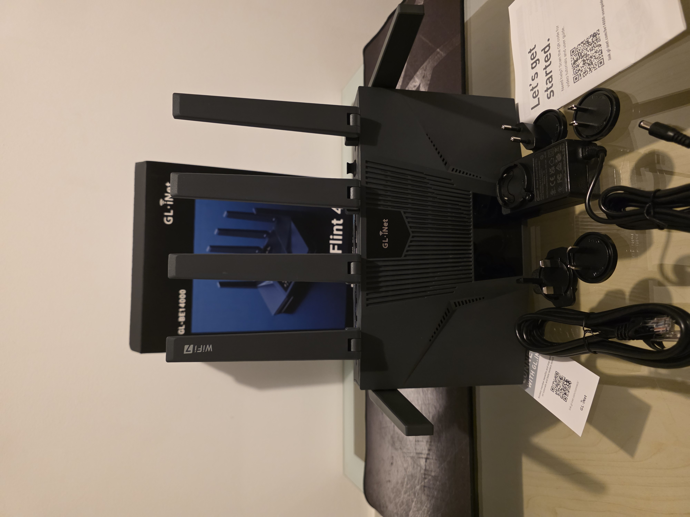

Physically, the Flint 4 is a noticeably different shape from the Flint 2 — wider and flatter, with six external antennas fanning out from the top rather than the Flint 2's more compact antenna layout. Build quality feels solid; the top vents are generous, which makes sense given this is meant to push considerably more throughput than the Flint 2.

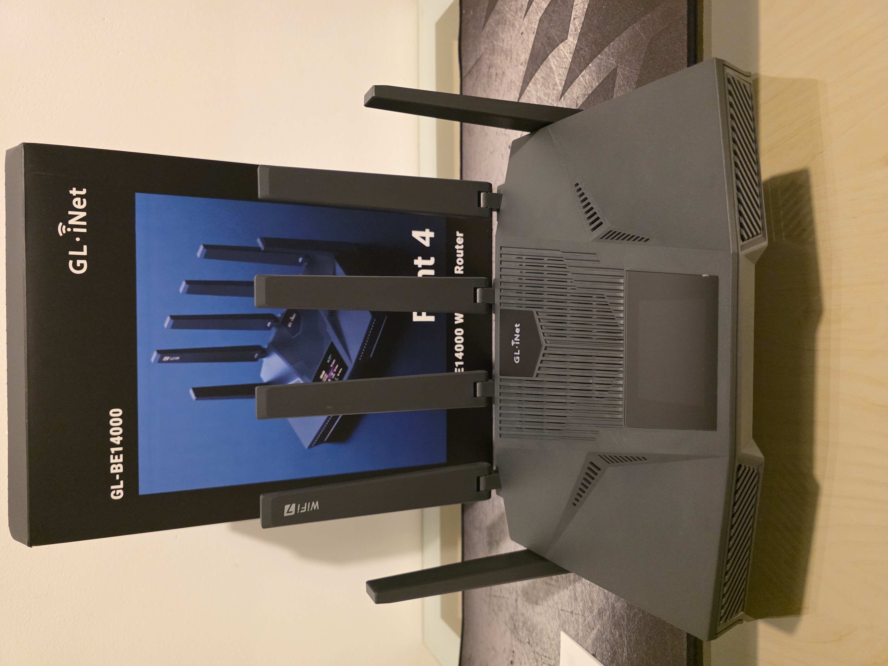

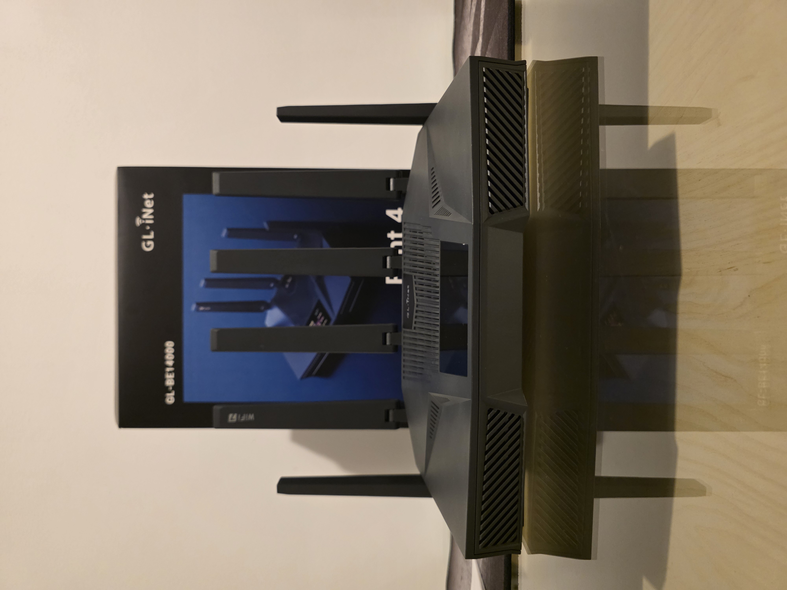

One nice touch: a USB-C port alongside a USB 3.0 port on the side panel — more flexible than the Flint 2's port selection for accessories.

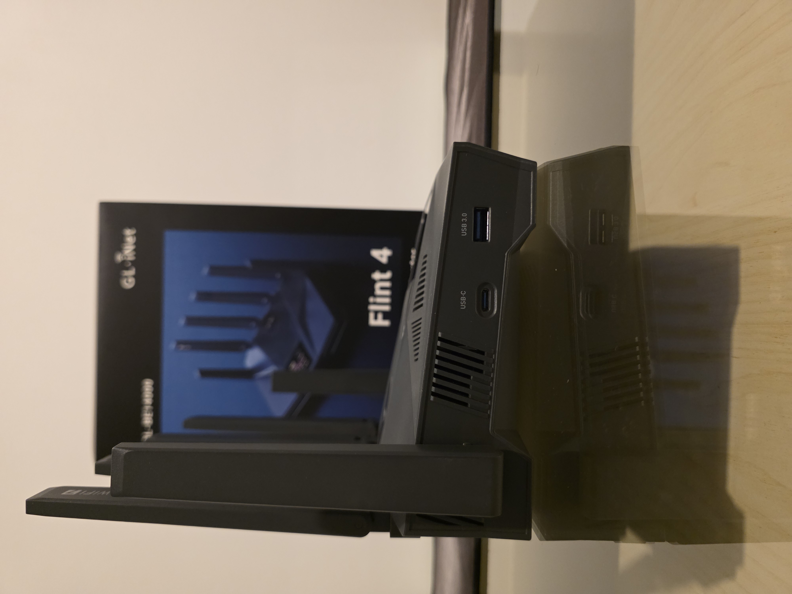

---

## 3. Hardware & Spec Overview

Model: **GL-BE14000**. Full specs, confirmed against GL.iNet's official sheet:

| Spec | Detail |
|---|---|
| CPU | MediaTek Quad-Core Cortex-A73 @ 1.8GHz |
| Memory / Storage | DDR4 2GB / eMMC 64GB |
| Wi-Fi standard | 802.11a/b/g/n/ac/ax/be (Wi-Fi 7) |
| Wi-Fi speed | 688 Mbps (2.4GHz) / 4323 Mbps (5GHz) / 8646 Mbps (6GHz) |
| Antennas | 6 x foldable external |
| Power input | 12V/4A |
| Power consumption | <25W without USB load, <45W with USB load |
| Dimensions / Weight | 293 x 172 x 76mm / 1166g |

**Real-world power consumption, measured**

GL.iNet quotes "<25W without USB load" — a ceiling rather than a typical figure, so it's worth knowing where a real installation actually sits inside that envelope. A Tapo smart plug monitoring the router's draw over a full 24-hour period:

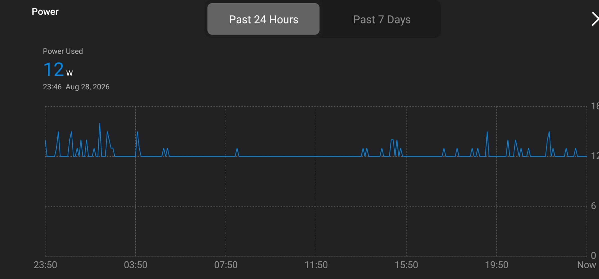

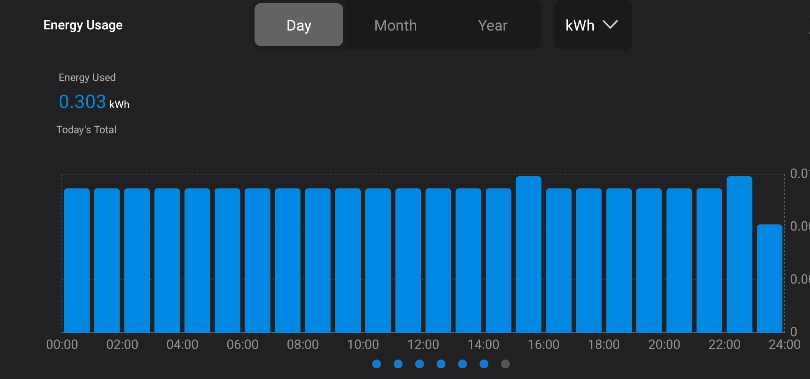

- **Baseline draw: ~12W**, with brief spikes to 16–17W (visible as short spikes throughout the 24-hour graph — likely CPU activity from background services, DHCP renewals, or similar periodic tasks)
- **Total energy used over 24 hours: 0.303 kWh**, which works out to a 12.6W average — consistent with the baseline reading and confirming the graph isn't misleading
- That's **roughly half** the quoted <25W ceiling, running as a fully configured daily-driver router (VLANs, WireGuard site-to-site tunnel active, Wi-Fi broadcasting on all bands) — not a stripped-down or idle test bench unit. Nothing was drawing from the USB ports during this window, so the <45W figure isn't being tested here.

For anyone budgeting running costs: at ~12.6W continuous, that's about 0.3 kWh/day or roughly 110 kWh/year — modest for a router with three radios and this much port silicon.

**Ports:**

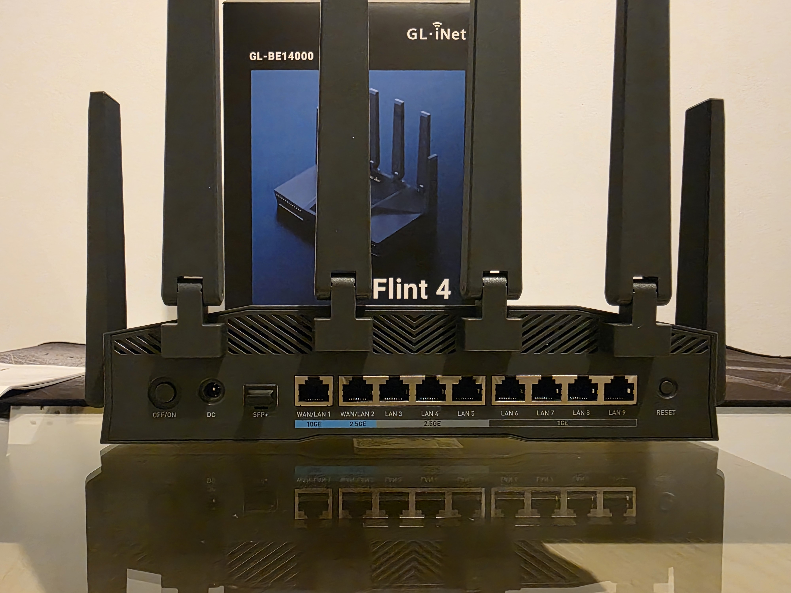

| Panel label | Port | Speed |
|---|---|---|
| Port 01 | SFP+ | 10G (WAN/LAN) |
| Port 02 | WAN/LAN 1 | 10G (RJ45) |
| Port 03 | WAN/LAN 2 | 2.5G |
| Ports 04–06 | LAN 3–5 | 2.5G (x3) |
| Ports 07–10 | LAN 6–9 | 1G (x4) |
| — | USB 3.0 | Type-A + Type-C |

So: **two independent 10G WAN/LAN interfaces** — the RJ45 and the SFP+ cage are separate ports, not a shared combo, so both can be in use at once. Alongside them, a second 2.5G port that can also serve as WAN, three more 2.5G LAN ports, and four 1G LAN ports. That's ten Ethernet interfaces in total and a very different port mix from the Flint 2 — the main structural upgrade reason for anyone on a faster-than-gigabit connection.

Also visible: physical OFF/ON switch and a dedicated RESET button on the rear panel — a small but appreciated detail for anyone who's had to hunt for a reset pinhole on other routers.

The 1.8GHz quad-core Cortex-A73 and 2GB RAM are worth keeping in mind for later sections — that's the ceiling for how much DPI/inline processing and simultaneous WireGuard throughput the router can realistically handle before CPU becomes the bottleneck rather than the network links themselves.

**Flint 2 vs Flint 4, side by side:**

| Spec | Flint 2 (GL-MT6000) | Flint 4 (GL-BE14000) |
|---|---|---|
| Platform / SoC | MediaTek Filogic 830 (MT7986) | MediaTek Filogic 880 (MT7988) |
| CPU | Quad-core Cortex-A53 @ 2.0GHz | Quad-core Cortex-A73 @ 1.8GHz |
| RAM | 1GB DDR4 | 2GB DDR4 |
| Storage | 8GB eMMC | 64GB eMMC |
| Wi-Fi | 802.11ax (Wi-Fi 6) | 802.11be (Wi-Fi 7) |
| Fastest port | 2x 2.5G | 2x 10G + 4x 2.5G |
| Antennas | 4 | 6 |
| Power | <20W | <25W without USB load / <45W with USB load |
| Dimensions | 233 x 137 x 53mm | 293 x 172 x 76mm |
| Weight | 761g | 1166g |

One line in that table deserves a second look, because it reads as a downgrade: the Flint 4's nominal clock is *lower* (1.8GHz vs 2.0GHz). It isn't a downgrade, and the reason is in the row above it. The Filogic 830 uses **Cortex-A53** cores; the Filogic 880 uses **Cortex-A73**. That's not a re-clock of the same chip — A53 is an in-order core, A73 is a wide out-of-order design, and the per-clock performance gap between them is large enough that 1.8GHz of A73 comfortably beats 2.0GHz of A53 on the same work. The platform jump is also what enables native 10G (the Filogic 830 tops out at 2.5G) and a more capable switch/NPU. So: newer architecture, not just "more RAM" — the RAM and storage increases are real, but they aren't the main story.

---

## 4. Initial Setup

The admin panel opens on an **Overview** dashboard with a firmware update reminder and a **Network Guide** card offering quick paths for Router, Repeater, and other modes:


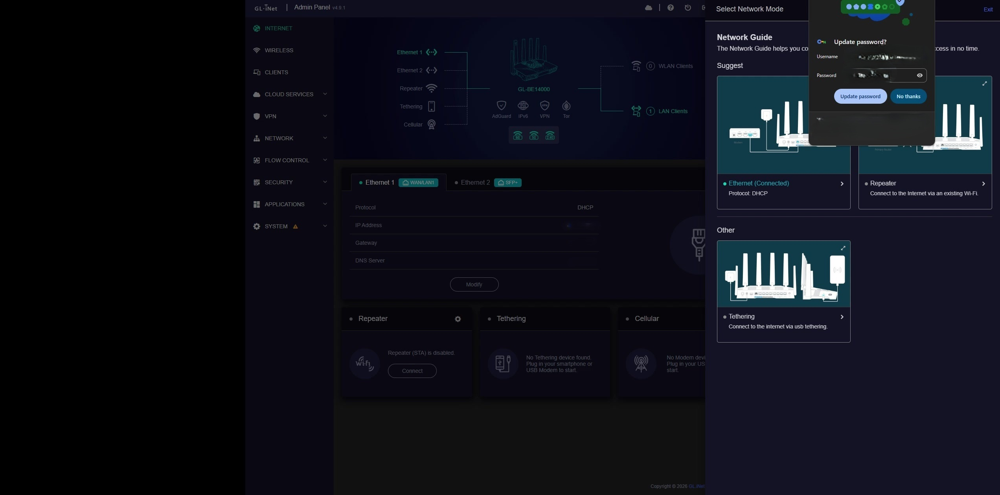

Firmware updates are handled from **System → Upgrade**, with separate tabs for online and local upgrade:

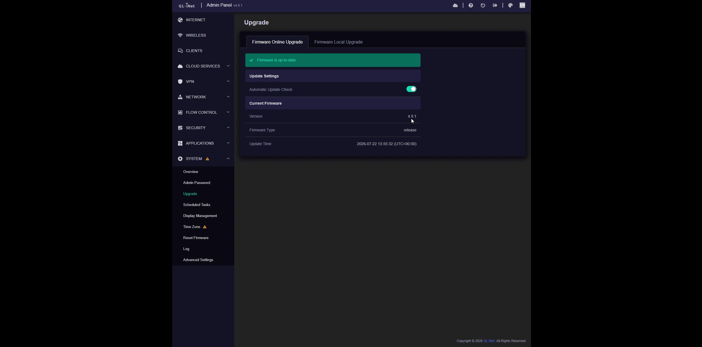

One nice touch: the Flint 4 has a 2.4-inch touchscreen display on the top panel (visible in the unboxing photos), configurable from **System → Display Management** — brightness, screen timeout, and what's shown on it:

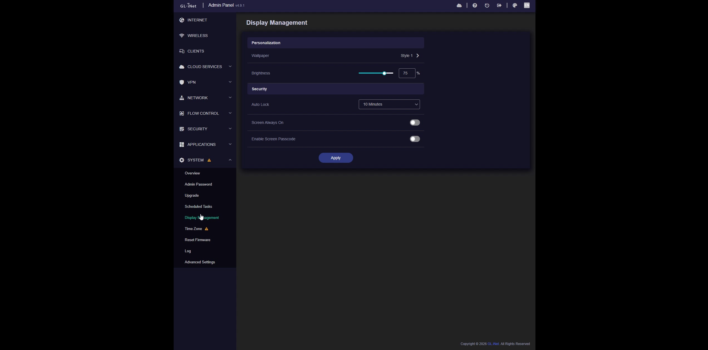

For anyone who wants to go beyond the GL.iNet UI, there's a toggle to enable the full **LuCI (OpenWrt) advanced interface**, which sits underneath the friendlier GL.iNet panel — same as on the Flint 2, so this should feel familiar if you're already comfortable in LuCI.

The original testing in Sections 5–10 was done on firmware **v4.9.1**, the stable release at the time. The router has since moved to the 4.11 beta line — see Section 11.

---

## 5. Migration from Flint 2 — What Carried Over, What Didn't

Short version: almost nothing was imported. VLANs, WireGuard, and DDNS were all rebuilt from scratch on the Flint 4 rather than restored from a backup — partly because GL.iNet doesn't offer a clean cross-device config import, and partly because it was a good opportunity to double-check every setting rather than carry over years of accumulated Flint 2 config debt unquestioned.

**DDNS**: The custom afraid.org updater script from the Flint 2 got reused, but not as-is — it was audited and reworked first. The afraid.org tokens were split out of the main update script into a separate config file, and the WAN-device/IPv6 detection logic was made hardware-agnostic instead of being hardcoded to the Flint 2's specific interface names. That means the same script now works unmodified across both routers, which wasn't true of the original version.

**VLANs**: Rebuilt from scratch rather than imported, mirroring the same Main/Guest/IoT-style segmentation used on the Flint 2 — same logical zones, just re-created manually on the Flint 4's switch rather than migrated over.

**WireGuard**: Configured as a site-to-site tunnel to a GT-AX11000 (Asus, Merlin firmware) running as an exit node in another country, re-entered manually rather than restored from backup.

**AdGuard Home**: Also active on the Flint 4, with the same DNS-over-TLS upstream setup described in the intro. Real usage stats and blocklist configuration are covered in Section 10, once there was enough accumulated traffic to be meaningful.

**Debloat pass**: Skipped this time. The Flint 2 (MediaTek Filogic 830) has 1GB DDR4 RAM, while the Flint 4's newer Filogic 880 (MT7988) platform has 2GB — plenty of headroom to leave background services running as-is, without the strip-down that helped on the Flint 2.

---

## 6. VLAN Setup

Here's the setup as managed from the GL.iNet **Subnet** page — three VLANs, matching the Main/Guest/IoT segmentation carried over conceptually from the Flint 2 (see Section 5):

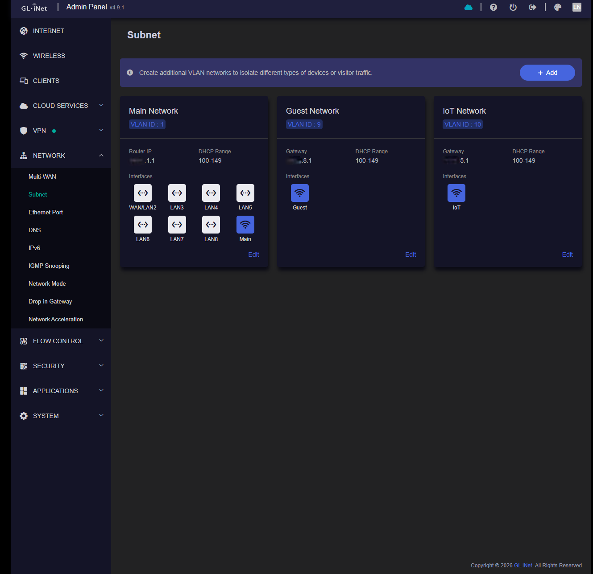

| Network | VLAN ID | Interfaces |
|---|---|---|
| Main | 1 | WAN/LAN2, LAN3–8 (wired), Main Wi-Fi |
| Guest | 9 | Guest Wi-Fi only |
| IoT | 10 | IoT Wi-Fi only |

Each network has its own DHCP range (100–149) on its own subnet, and Guest/IoT are wireless-only — no wired ports assigned to either, which keeps physically-connected devices on the trusted Main network by default unless deliberately placed elsewhere. Main claims most of the physical LAN ports (WAN/LAN2 through LAN8), which makes sense given wired devices are generally the trusted, managed side of the network.

(LAN9 doesn't appear in any of the three cards above because it carries a fourth VLAN for video, set up by hand over SSH rather than through the Subnet page — which is why it shows as linked in the Ethernet Port screenshot later on but not here.)

This is the simplified Subnet view rather than raw LuCI Switch VLAN tagging — for straightforward Main/Guest/IoT segmentation like this, the GL.iNet panel handles it without needing to drop into LuCI at all, which is a nice contrast to how much of this had to be done by hand via UCI on the Flint 2. Anything outside that pattern still goes in via UCI, as the video VLAN did.

---

## 7. VPN / WireGuard Setup & Performance

**ProtonVPN speedtest, Flint 4 vs Flint 2 — same provider, same connection:**

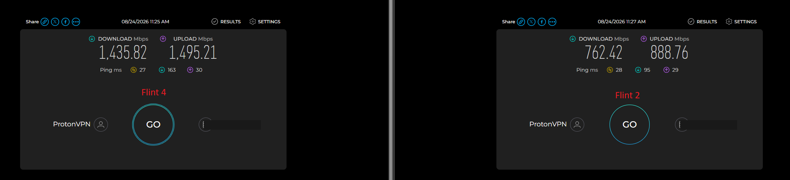

- **Flint 4**: 1,435.82 Mbps down / 1,495.21 Mbps up, 27ms ping
- **Flint 2**: 762.42 Mbps down / 888.76 Mbps up, 28ms ping

**How these were measured:** both speedtests were run **directly on each router** — Ookla's CLI bound to the WireGuard tunnel interface (for example `./speedtest -I wgclient`) — not from a device connected to the router. That measures what the router itself can push through a tunnel, with no Wi-Fi or LAN hop in the path, and the same method was used on both routers, so the comparison between them is like-for-like. The flip side is that the router is also running the test process while it encrypts, so it isn't identical to a laptop or phone behind the router; a test like that is covered in the update further down.

Nearly a 2x improvement, and both figures land almost exactly on their respective vendor claims: GL.iNet rates the Flint 4 at **up to 1.5 Gbps WireGuard**, and the Flint 2 at **up to 900 Mbps**. Measured 1,435/1,495 and 762/888. It's rare for marketing throughput numbers to survive contact with a real connection this cleanly, and it's worth saying so — the claimed VPN figures on both routers are honest ones.

This is commercial VPN throughput with the router acting as the WireGuard *client* (connecting out to ProtonVPN), which is a separate measurement from the site-to-site tunnel discussed below; the two shouldn't be read as one data set.

**VPN Dashboard, configured with three tunnels** *(the 4.9.1 setup — on 4.11 the site-to-site tunnel to the GT-AX11000 is the one in daily use, see Section 11)*:

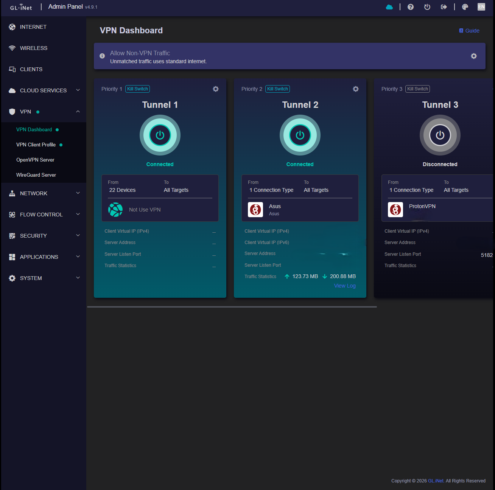

| Priority | Tunnel | Status | From | Traffic |
|---|---|---|---|---|
| 1 | Tunnel 1 (bypass) | Connected | 22 devices, "Not Use VPN" | — |
| 2 | Tunnel 2 (Asus) | Connected | 1 connection type | 123.73 MB up / 200.88 MB down |
| 3 | Tunnel 3 (ProtonVPN) | Disconnected | 1 connection type | — (server listen port 5182 configured) |

Tunnel 2 is the site-to-site WireGuard link to the GT-AX11000 exit node (Section 5) — actively passing traffic, with real transfer stats. Tunnel 1 is a deliberate bypass rule for 22 devices that should use standard internet rather than any tunnel. Tunnel 3 (ProtonVPN) is configured but not currently active — matches the commercial VPN speedtest comparison in this section, just not connected at the moment this screenshot was taken.

**CPU load during a tunneled speedtest, run directly on the router via SSH:**

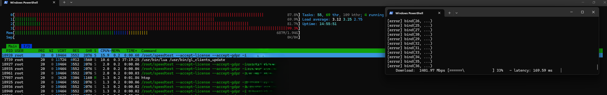

Running Ookla's speedtest CLI *from the router itself*, through the WireGuard tunnel, pins the CPU hard — three of four cores in the high 80s/90s%, one core at 99.3%, load average 3.12. Latency during the test read 169.59ms (elevated, as expected for tunneled traffic to an exit node in another country), with download climbing to 1,401.97 Mbps at the point captured. The `[error] bind(26...)` messages scrolling in the second window aren't a router bug — that's normal behavior for Ookla's CLI as it probes multiple local ports/connections through the tunnel interface; the test completes and returns a valid result regardless. Memory sat at 687MB/1.94GB, comfortably within the 2GB budget even under this load.

Worth noting for context: this is CPU load from running the *test itself* on the router (SSH + speedtest process), not purely from routing tunneled traffic for other clients — a real client-driven throughput test would isolate WireGuard's own CPU cost more cleanly. Still, it's a useful data point on how hard the Cortex-A73 gets pushed when the router itself is doing VPN-tunneled work.

**Update — a test from a device behind the router.** That caveat can now be closed out. With a LAN client running a speedtest through the WireGuard tunnel (so the router is only forwarding, not running the test), CPU0 is the busy core: **96–97% during download and 79–90% during upload**, while CPU1–3 stay at roughly 30–70%. That fits WireGuard's crypto running in software on this firmware (ChaCha20, NEON-accelerated), with the busiest core setting the pace. The practical reading is that a single tunnel is bounded by how fast one core can push it — which sits comfortably with GL.iNet's "up to 1.5 Gbps" being a ceiling for one tunnel, and the 1.4–1.5 Gbps ProtonVPN results above (run on the router itself) show that ceiling is genuinely reachable. (Measured on the 4.11 beta firmware.) The on-router crypto benchmark in Section 8 fits that picture: software ChaCha20 measures about 2.2 Gbit/s at 1,420-byte packets there (a single-thread figure, as far as I can tell), so 1.4–1.5 Gbit/s of real WireGuard throughput is a large share of what one core can do.

**Same test, without the tunnel — a clean before/after:**

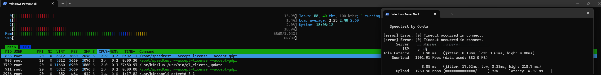

Running the identical Ookla CLI test directly on the router, but *without* going through any VPN tunnel, tells a very different story:

| | With VPN tunnel | Without tunnel (direct WAN) |
|---|---|---|
| CPU cores | 3 cores 80s–90s%, 1 core 99.3% | All cores under 20% (peak 18.9%) |
| Load average | 3.12 | 2.35 |
| Idle latency | 169.59ms | 3.98ms |
| Download | 1,401.97 Mbps (at 33%) | 1,901.91 Mbps |
| Upload | — | 1,760.96 Mbps (at 72%) |

*(No upload figure for the tunneled test — the screenshot was captured mid-run at 33% download progress, before the test reached its upload phase. The download figure is therefore a mid-run reading, not a final average.)*

One caveat on the load-average row: this router's *resting* load average sits at ~2.3–2.4 (see Section 10), so 2.35 in the right-hand column is the idle baseline, not a load measurement — the per-core percentages are the meaningful comparison here. That resting figure is itself unusually high for an idle 4-core router and is worth a note of its own; see Section 10.

Same router, same test tool, same methodology — the only variable is whether traffic goes through the WireGuard tunnel to the ProtonVPN exit node. The difference is stark: latency jumps roughly 40x, CPU goes from near-idle to three-plus cores pegged, and throughput drops noticeably. None of this is a knock against the router — it's expected VPN and geographic-distance behaviour — but it puts a number on the cost instead of leaving it at "VPN adds overhead".

**Update — site-to-site tunnel throughput, and one setting worth checking: tunnel MTU**

Section 8 originally skipped an iperf3 run through the GT-AX11000 tunnel, on the grounds that the exit node's own line (500/500 Mbps, in another country) would be the ceiling. It has since been run, and it turned up something useful for anyone whose far end isn't a plain Ethernet WAN.

The exit node's WAN is PPPoE, which leaves a 1492-byte MTU instead of 1500. The WireGuard default of 1420 plus the outer IPv6/UDP overhead no longer fits inside that, so full-size tunnel packets get fragmented on the way out — and the symptom is throughput that stalls or collapses rather than anything that looks like a clear error. Measured with the same iperf3 setup at each tunnel MTU:

| Tunnel MTU | What happened |
|---|---|
| 1420 (default) | An early run stalled at 0 bit/s; a later 10-second single-stream retest managed 12 Mbit/s one way and 247 Mbit/s the other. The far end's WAN was sending **about 2× as many packets as the tunnel carried** — fragmentation |
| 1412 | Ran (214 / 341 Mbit/s) but still fragmenting, and one direction dropped to 0 for its last 4 seconds |
| **1400** | **Clean — WAN and tunnel packet counts match about 1:1.** 452 Mbit/s one way over 30 s with ~0.03% retransmits; 172–304 Mbit/s the other, depending on stream count |

The 452 Mbit/s is about 90% of that 500 Mbps line, so with the MTU right the tunnel is limited by the far-end connection, as expected. (The other direction is lower and more variable — the single-stream runs were still ramping up when they finished — and I haven't dug into the cause beyond ruling out the MTU.)

**How to check yours:** during a saturating iperf3 run through the tunnel, compare the transmit packet count on the far end's WAN interface with the tunnel interface's. About 1:1 means no fragmentation; about 2:1 means the MTU is too high. This was far more reliable than DF-flag ping sweeps, which gave inconsistent answers because the packet counters they lean on are shared with other traffic. If your tunnel's far end sits behind PPPoE (or anything else under 1500), it's a quick check that can be worth hundreds of Mbit/s.

**VPN Client Profile setup — and how the three tunnels actually differ**

The **VPN Client Profile** page is where WireGuard configs get grouped by provider — "Asus" (the site-to-site peer) and "ProtonVPN" as separate groups, each holding one or more uploaded `.conf` files:

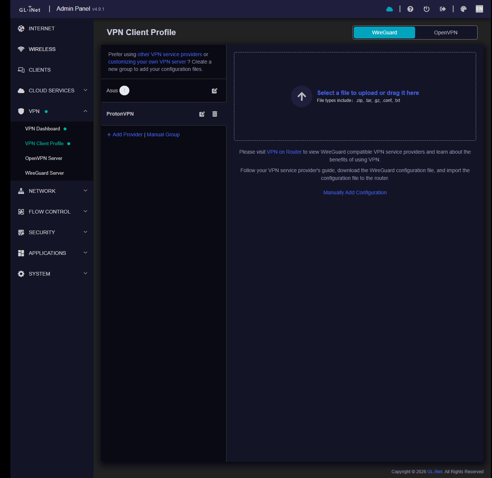

Adding a provider is a straightforward drag-and-drop of the `.conf` file, with pass/fail validation before it's usable:

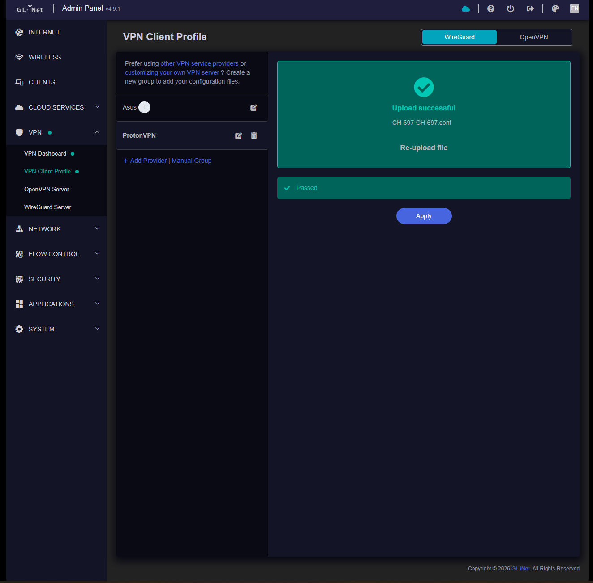

Setting up a tunnel walks through three steps — pick the uploaded profile, choose which client traffic uses it, then apply. This is where the real routing design shows up: rather than routing all traffic through every tunnel, **each tunnel is scoped to specific traffic**:


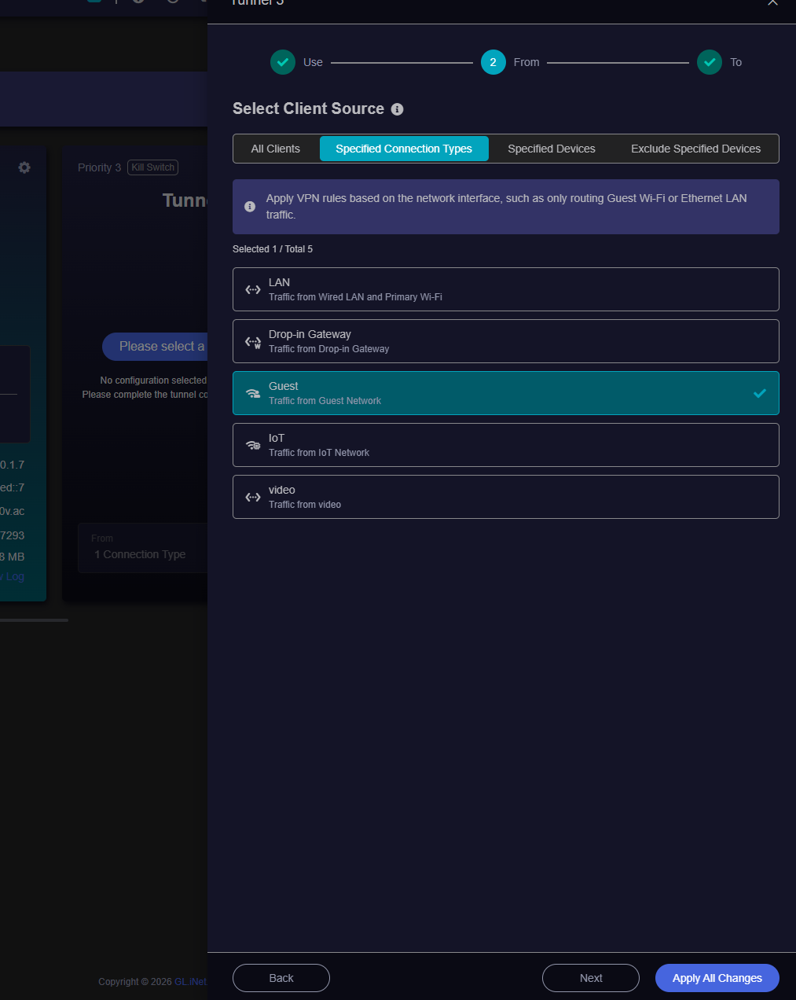

Specifically, Tunnel 2 (the Asus site-to-site link) handles Guest network traffic — specifically, guest clients that aren't part of the 22-device bypass list on Tunnel 1. Tunnel 3 (ProtonVPN) isn't independent routing — it's a **failover backup for Tunnel 2**: if the site-to-site tunnel to the GT-AX11000 goes down, Guest traffic fails over to ProtonVPN rather than losing VPN coverage entirely or falling back to plain internet. That's what the Priority 1/2/3 ordering on the dashboard actually represents — not three independent tunnels doing different jobs, but a prioritized chain for the same guest traffic. So the real policy is: 22 trusted devices bypass VPN entirely, and Guest network traffic is VPN-protected with automatic failover between two providers. The underlying reason is that a few devices need to consistently appear as if they're connecting from a specific country and city — details beyond that aren't relevant here, but it's why Guest traffic specifically gets this treatment rather than the whole network.

Connecting a tunnel shows a live status transition from "Connecting..." to "Connected," with virtual IPs, server address, and running traffic stats once active:


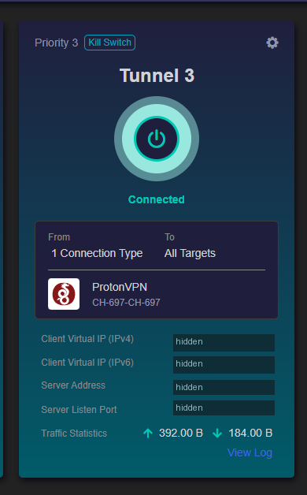

---

## 8. Speed Test & Throughput Results

No stock/unconfigured baseline was captured before setup — the router went straight into daily-driver use, so there's no clean "before" number to compare against. That's a fair limitation to state plainly rather than fake a comparison after the fact: this section shows throughput **as currently configured** (VLANs + WireGuard site-to-site tunnel active), not a staged progression.

**Direct WAN speedtest** (no VPN, run on the router via SSH, Ookla CLI): **1,901.91 Mbps down / 1,760.96 Mbps up**, 3.98ms idle latency — see Section 7 for the comparison against the same test through the VPN tunnel. Note this is within a few percent of the 2 Gbps ISP ceiling, so it is a measurement of the *connection*, not of the router's limit.

**Current-state LAN-to-LAN throughput** (Flint 2 → PC, PC connected to Flint 4, traffic passing through Flint 4's switch): **2.35–2.36 Gbit/s combined across 4 parallel streams, 0 retransmits, sustained over 30s.**

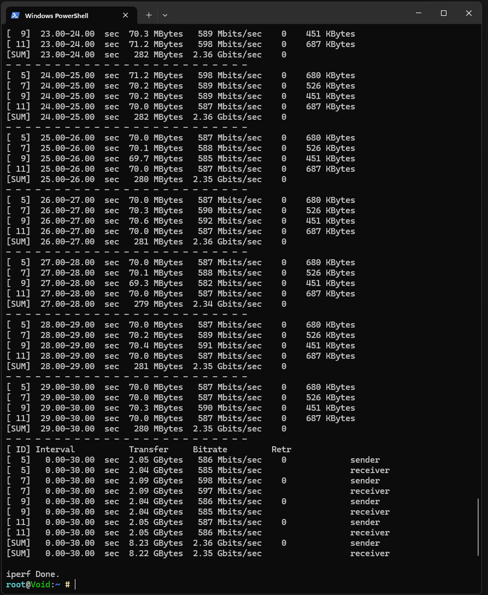

Test initiated from Flint 2's shell rather than the PC, since Flint 2's WAN-side firewall rejects unsolicited inbound connections from the Flint 4 side; running iperf3 client-to-server in the outbound direction sidesteps that cleanly. Result is ~94% of the theoretical 2.5G port ceiling — a strong, clean number.

**Aggregate test — and an unexpected finding**

Running Void2 (Flint 2) → PC *at the same time* as PC → Flint 4's own CPU produced a surprising asymmetry: the direct PC↔Flint 4 stream held its full ~2.36 Gbit/s, but the Void2→PC stream collapsed to **~660 Mbit/s** — reproducible across two separate runs

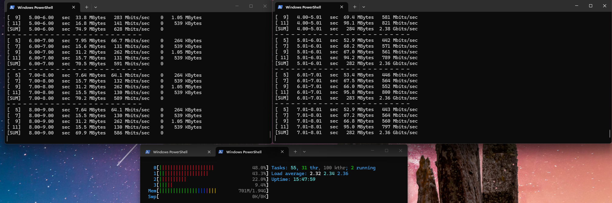

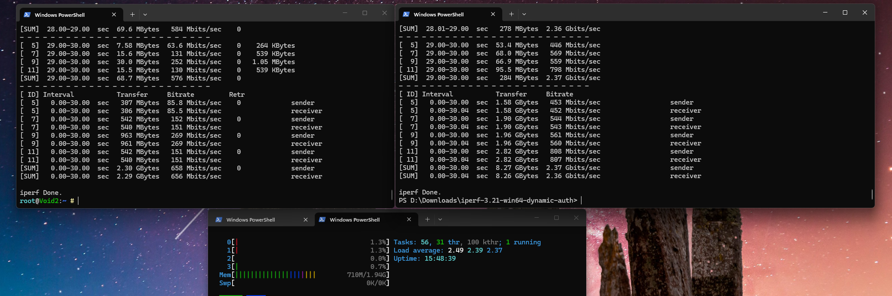

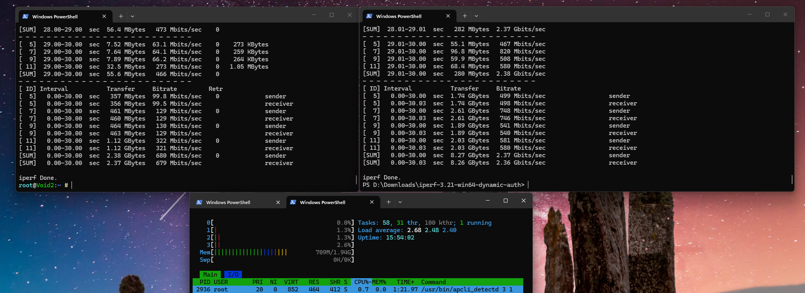

That was surprising enough to warrant actually tracking down the cause rather than just reporting it as-is.

**Ruled out, in order:**
1. **Cable/port errors** — `ethtool -S eth1 | grep -i -E "error|drop|crc"` on Void2 showed every counter at zero.
2. **Port speed/negotiation** — confirmed directly via Flint 4's admin panel (**Network → Ethernet Port**): PC (WAN/LAN2) and Flint 2 (LAN3) both showed **2.5G**, same `main (1)` VLAN, same switch.

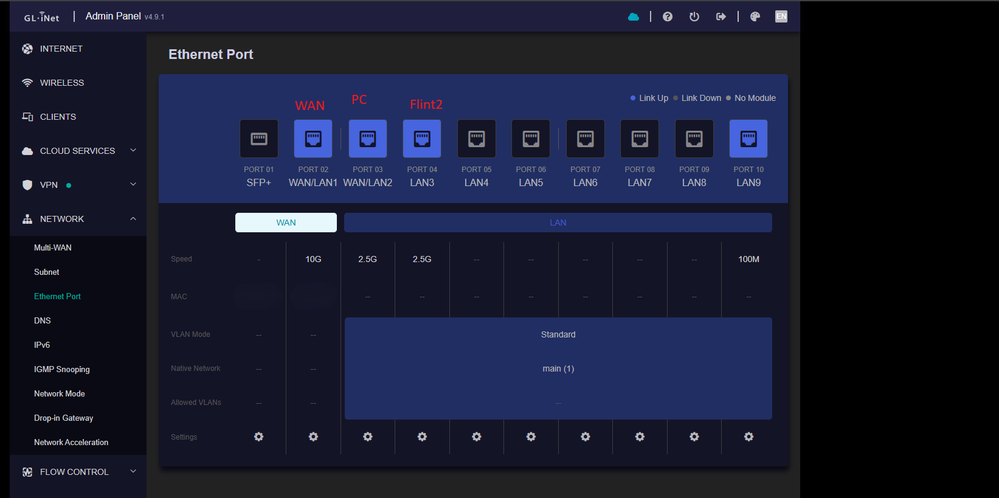

3. **Flint 4 CPU bottleneck** — idle (0–2.6% cores) during the degraded run.
4. **Void2 (Flint 2) CPU bottleneck** — also essentially idle: load average 0.02, the iperf3 client process itself using just 2% CPU.

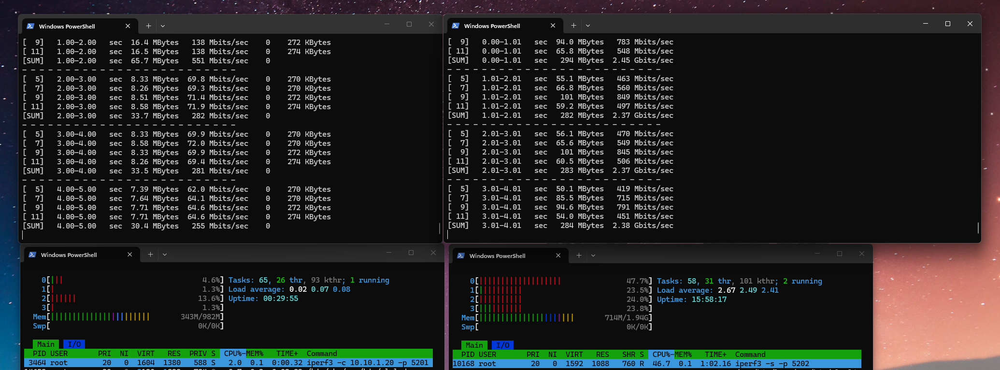

5. **Void2's general ability to push full throughput** — confirmed three separate times: solo to PC (2.35 Gbit/s), and solo directly to Flint 4's own CPU (2.35 Gbit/s, 0 retransmits):

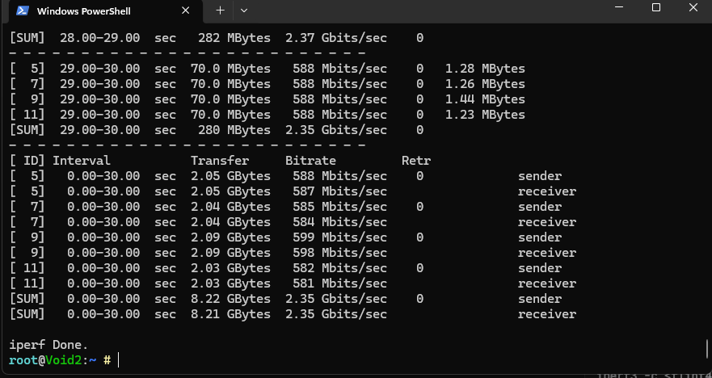

Nothing wrong with Void2's link or its ability to source traffic.

**The actual answer:** running Void2 → Flint 4-CPU *and* PC → Flint 4-CPU simultaneously — both streams terminating locally at the router's CPU on different ports, neither requiring cross-port forwarding — both hit full speed together: **2.34 Gbit/s** and **2.36–2.37 Gbit/s**, combined ~4.7 Gbit/s through the CPU at once, with 0 retransmits on either:

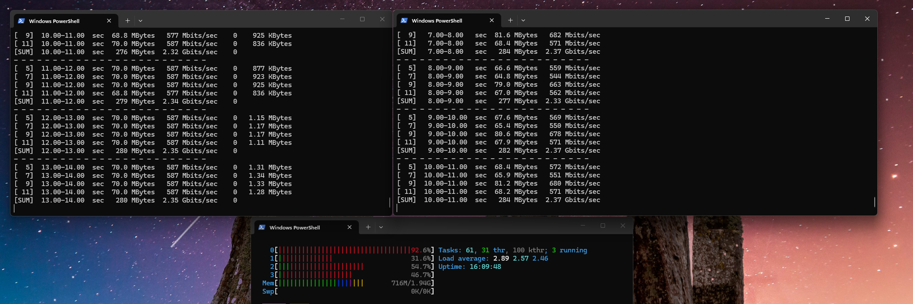

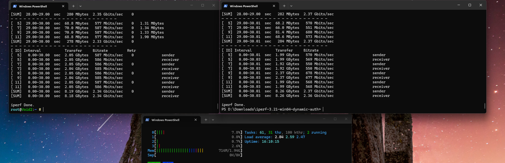

CPU load during this was real — one core hit 92.6% — but throughput held.

So the earlier degradation wasn't about CPU capacity, port speed, cabling, or general port priority — all of those held up fine or better under more combined load than the original test. **It was specifically about cross-port forwarding**: when a stream has to be switched from one physical port to another (Flint 2 on LAN3, forwarded out to PC on WAN/LAN2), and that egress port is simultaneously busy serving CPU-terminated traffic of its own, the forwarded stream gets starved — while CPU-local traffic on multiple ports at once does not have this problem.

**Working theory** (not confirmed at the driver/NPU level): this is likely related to how the Network Acceleration engine prioritizes CPU-sourced/CPU-sunk traffic over hardware-forwarded inter-port traffic when both compete for the same egress port. Worth noting as a real architectural characteristic for anyone planning heavy LAN-to-LAN transfers (e.g. NAS traffic between two wired devices) while also running CPU-heavy services on the router itself (VPN server, speedtest, etc.) — the two can contend in a way that isn't obvious from spec sheets.

**How much the hardware path matters: Network Acceleration on vs. off**

That theory points at the Network Acceleration engine, so the obvious next question is how much work that engine is actually doing. This next test doesn't confirm the cross-port starvation theory — it's a different traffic pattern (WAN routing over Wi-Fi, not LAN-to-LAN switching), and it should be read as *establishing that the accelerated path is doing the heavy lifting*, not as proof of the starvation mechanism. Same PC, same 6GHz Wi-Fi connection, same Speedtest, with Network Acceleration toggled off and back on:

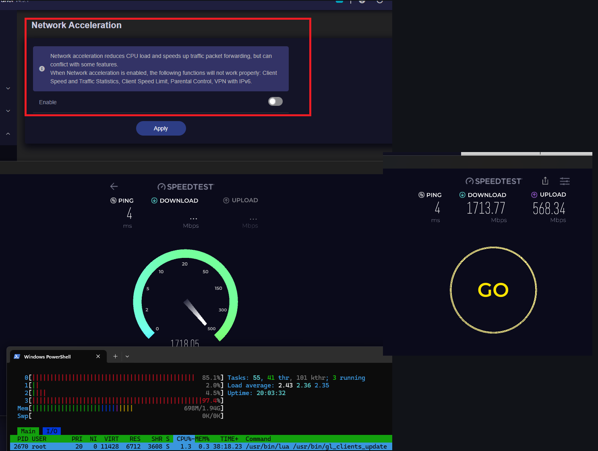

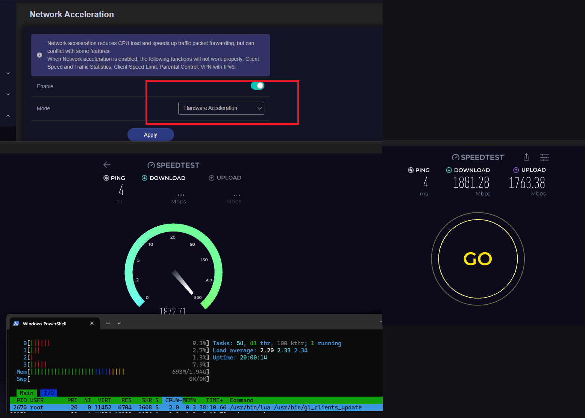

| | Acceleration OFF | Acceleration ON (Hardware) |
|---|---|---|
| Download | 1,713.77 Mbps | 1,881.28 Mbps |
| Upload | **568.34 Mbps** | **1,763.38 Mbps** |
| CPU (during test) | Core 0: 85.1%, Core 3: 97.4% | All cores under 10% |
| Load average | 2.43 / 2.36 / 2.35 | 2.20 / 2.33 / 2.34 |

With acceleration off, upload collapses to under a third of its accelerated value (568 vs. 1,763 Mbps) and two CPU cores get pinned near-100% handling routing in software. With it on, upload more than triples, download improves too, and CPU barely registers the load — the router is offloading packet forwarding to hardware rather than processing every packet on the CPU.

(The load-average row moves almost not at all between the two runs, which looks odd next to two pinned cores. That's the ~2.3 resting baseline again plus load-average lag over a 30-second test; the per-core percentages are the figure to read.)

This also contextualizes every other throughput number here: **Network Acceleration was enabled throughout**, so every result in this review already reflects the accelerated path. Anyone replicating these numbers with acceleration off should expect meaningfully worse upload performance and much higher CPU load, especially on WAN-facing throughput. It's also a practical illustration of why the trade-off (losing accurate Client Speed/Traffic Statistics and IPv6 VPN support, per the router's own warning) is worth accepting for most people — the performance gain is not subtle.

**The consequence: DPI and full throughput are mutually exclusive**

Deep packet inspection needs the CPU to see every packet, and hardware offload exists precisely so that it doesn't. Enabling DPI therefore means turning Network Acceleration off — and the A/B above puts a hard number on what that costs: upload drops from 1,763 Mbps to 568 Mbps, with two cores pinned near 100%.

On a connection this fast that's a straight either/or: **per-application traffic visibility, or your full upload speed — not both.** I've gone with throughput and left DPI off entirely, for this review and for daily use. This isn't a GL.iNet quirk — any router leaning on an NPU offload path faces the same trade — but it's worth knowing before buying if per-application visibility is something you actually need.

**On the IPv6 half of that warning** — in practice it didn't bite. Native dual-stack IPv6 ran perfectly throughout this review with Network Acceleration enabled, and IPv6 over the WireGuard tunnel worked properly too: with the tunnel up, an IPv6 address check returns the **exit node's** address rather than my own ISP's, confirming v6 traffic is genuinely being carried through the tunnel and not quietly bypassing it. That's the distinction that matters, since a v6 leak around the tunnel would look identical to "IPv6 works" from the client side.

So the panel's warning is more conservative than the behaviour observed here — worth knowing if it would otherwise have put you off enabling acceleration on a dual-stack connection.

**Sustained WAN throughput and thermals — a real 15-minute run**

Every other test in this section ran for 30 seconds. Worth also showing what happens over a sustained transfer, run directly from the router via SSH against a public internet iperf3 server rather than a LAN target:

```
iperf3 -c <public-iperf3-server> -p 5201 -t 900 -R
```

900 seconds (15 minutes), reverse mode — so the router is downloading from a real public internet host, not just testing LAN capacity:

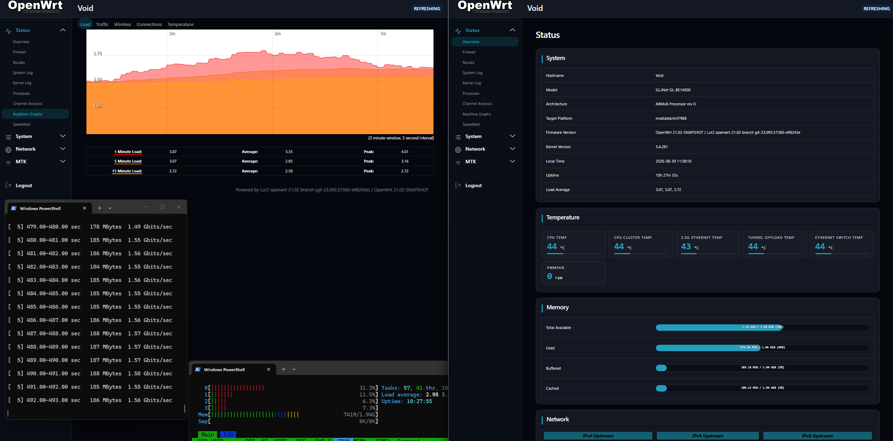

The visible tail of the run (roughly 8 minutes in) holds a steady **~1.55–1.58 Gbit/s**, with no degradation or instability over the duration. That's below the 1.9 Gbit/s the Ookla test reached, and the gap is expected rather than a router limitation: this is a single TCP stream to a single public host across the open internet, where Ookla opens several tuned parallel connections to a nearby, well-provisioned server. Sustained single-stream throughput to a third-party endpoint is the harder test, and holding 1.55 Gbit/s of it for fifteen minutes without wobble is the actual result here.

LuCI's Realtime Graphs confirm the load stayed elevated but bounded throughout: 1-minute load average 3.35 (peak 4.01), settling to a 15-minute average of 2.59 — a real, sustained increase over the router's resting baseline (~2.3–2.4 throughout this review), but nothing close to concerning.

*(A courtesy note if you're replicating this: a 15-minute run at this rate pulls roughly 170 GB from a free public iperf3 server. Worth being sparing with.)*

**Thermals under 15 minutes of sustained load**: CPU 44°C, CPU Cluster 44°C, 2.5G Ethernet 43°C, Tunnel Offload 44°C, Ethernet Switch 44°C — fan still at 0 RPM throughout. Genuinely reassuring: even a long, real sustained transfer didn't need active cooling, and these readings are actually a touch *lower* than the idle temperatures captured in Section 10's first status check-in (49°C CPU) — most likely a difference in ambient room temperature between the two captures rather than load somehow lowering temps, but either way there's no sign of thermal stress under sustained load.

**One honest note this screenshot surfaced**: the uptime shown here is **10h 27m 55s** — noticeably less than the **20h 36m 2s** captured in Section 10's first check-in, meaning a reboot happened at some point between those two captures. Turned out to be a scheduled weekly reboot via crontab, not anything unexpected — worth mentioning that this kind of self-imposed reboot schedule exists on this setup, since it means uptime alone isn't a reliable stability signal here (see Section 10).

**Update — sustained runs on the 4.11 beta, both directions, with per-core numbers**

The original run above has no per-core CPU data, so it was repeated on the 4.11 beta with a small router-side logger sampling CPU, temperatures, fan and load every 5 seconds. Both runs were **5 minutes** (not 15), over native IPv6, from the router to the same public server:

```
iperf3 -c <public-iperf3-server> -p 5201 -t 300 -i 10         # upload (router → server)
iperf3 -c <public-iperf3-server> -p 5201 -t 300 -R -i 10      # download, as in the original run
```

| | Upload | Download |
|---|---|---|
| Average | **1.68 Gbit/s** | **1.26 Gbit/s** |
| Range across 10-second intervals | 1.64–1.75 | 1.06–1.34 |
| Transferred | 58.6 GB | 44.2 GB |
| Retransmits | 54 | 1,224 |
| CPU, all four cores (avg / peak) | 10.8% / 14.0% | 17.9% / 22.8% |
| Busiest core by average | CPU3, 15.8% | CPU0, 24.3% |
| Highest single-core peak | 20.7% | 30.1% |
| Load average, 1-minute (avg / peak) | 0.4 / 0.7 | 0.4 / 0.7 |
| Memory used | 37.5% | 37.3% |
| Temperatures, eight kernel sensors | 40.2–41.3°C (peak 41.7) | 40.8–41.9°C (peak 42.3) |
| Fan | stayed off | stayed off |

**Upload** held close to 1.7 Gbit/s without sagging, for around a tenth of the router's CPU.

**Download is the more interesting result.** It averaged 1.26 Gbit/s, about 20% below the ~1.55–1.58 Gbit/s the 4.9.1 run held, and it wasn't as steady: most intervals sit at 1.30–1.34 Gbit/s with periodic dips to roughly 1.1, and the server-side sender logged 1,224 retransmits (against 54 for the upload). The router wasn't the limit — no core went above 30% — and retransmits on a download mean packets were lost somewhere between the server and the router.

The tiebreaker is the multi-stream test. Re-running the same Ookla CLI test on the router (a nearby test server) on the 4.11 beta gives **1,905.73 Mbps down / 1,817.92 Mbps up**, 3.59 ms idle latency and 0.0% packet loss — in line with the 4.9.1 direct-WAN result (1,901.91 / 1,760.96, 3.98 ms). So with several streams the router still receives at the full ~1.9 Gbit/s the line offers, which points at that single iperf3 stream's path to one public server (a single TCP connection slows down at every loss) rather than at the router. One pair of tests can't prove that, but it's the simplest reading.

Download costs more CPU than upload here (about 18% against 11%) despite moving less data per second, and both stay comfortably cool with the fan never starting. For comparison, the 4.9.1 download run above peaked at a 1-minute load of 4.01 and sat at 43–44°C; the 4.11 runs are lower on both counts, but much of the load gap is simply the resting baseline (about 0.25 on 4.11 against ~2.3 on 4.9.1 — see Section 10), and room temperature wasn't controlled, so I wouldn't read the temperature gap as a firmware effect. The per-core spread is the useful new information: the work is shared across all four cores, with no single core near its limit on a single-stream run to the internet. (The same is not true of WireGuard — see Section 7.)

**Latency under load (bufferbloat)**

The review's throughput tests say nothing about what happens to latency while the line is busy, which is what makes video calls and games feel good or bad. This was checked on the 4.11 beta with LibreQoS's browser bufferbloat test, run from a device on the LAN with **SQM off** (no traffic shaping). Two runs, the second shown below:

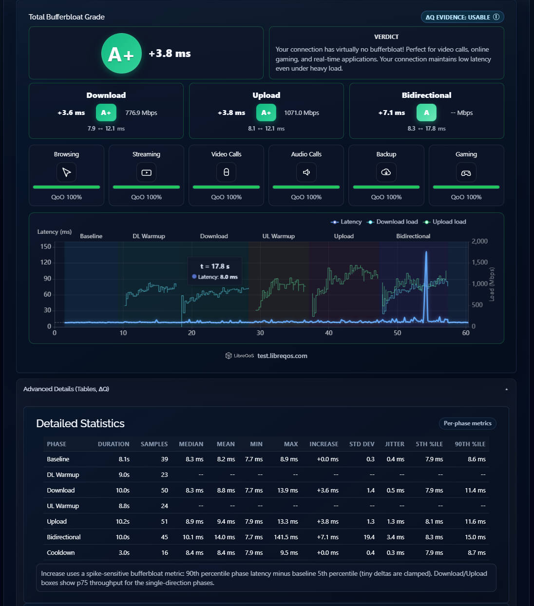

| | Run 1 | Run 2 |
|---|---|---|
| **Overall** | A, +6.4 ms | **A+, +3.8 ms** |
| Download | A+, +0.0 ms (1,114 Mbps) | A+, +3.6 ms (777 Mbps) |
| Upload | A, +6.4 ms (1,149 Mbps) | A+, +3.8 ms (1,071 Mbps) |
| Bidirectional | A, +6.9 ms | A, +7.1 ms |
| Baseline latency (median) | 8.4 ms | 8.3 ms |
| Highest latency in any phase | 23.4 ms | 141.5 ms (one spike; next highest 13.9 ms) |

Both runs graded A or better, with LibreQoS's verdict of minimal-to-no bufferbloat and all six of its use-case scores — browsing, streaming, video calls, audio calls, backup and gaming — at 100%. The one blemish is a single isolated spike to about 140 ms during run 2's bidirectional phase (visible in the chart); it didn't appear in run 1 and doesn't show up in the 90th-percentile figure for that phase (15.0 ms), but it's there, so it's reported.

Two qualifiers. The baseline is a property of the path to the test server rather than the router (Ookla's idle latency to a nearby server was 3.59 ms), so the useful figure is the *increase*. And this browser-based test loaded the line to roughly 0.8–1.1 Gbps of the 2 Gbps available, so it shows no meaningful bufferbloat at that load rather than at full line rate. With SQM off, it's a clean result.

**On-router benchmarks: storage, memory and crypto**

A benchmark tool on the router, which also carries comparison results for other GL.iNet routers, gives some cross-device context for storage, memory and VPN crypto. The Flint 2 is the one directly comparable to this review; the other rows come from the tool's own comparison data, so cross-device comparisons are indicative rather than definitive (the tool itself warns that each device uses its own OpenSSL build, and that eMMC read speeds can reflect the controller's cache).

*Storage (sequential, 1 GB).* **147.1 MB/s write and 171.2 MB/s read**, against 52.8 MB/s and 154.0 MB/s for the Flint 2 — about 2.8× the write speed, and the fastest write in the tool's table. The tool calls write the reliable cross-device number and read only indicative, so the write figure is the one to take away. Useful for anyone running AdGuard Home logs, monitoring databases or other services from the eMMC.

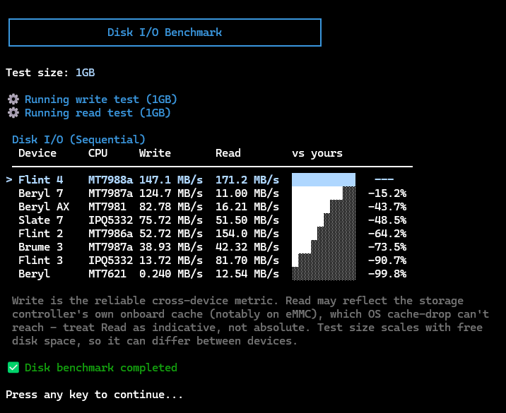

*Memory (2 GB).* **5,851 MB/s**, about 8% above the Flint 2's 5,402 MB/s and the highest in the tool's table — a modest step, not a leap.

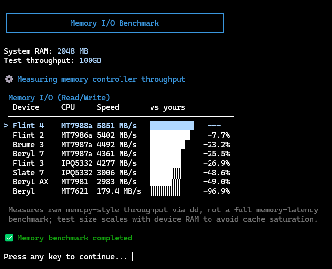

*Crypto (OpenSSL, packet-size dependent).*

| Test | Device | 64 B | 1,420 B | 16 KB |
|---|---|---|---|---|
| AES-256-GCM (OpenVPN / IPsec) | **Flint 4** | 756.6 Mb/s | **5,833 Mb/s** | **8,493 Mb/s** |
| | Flint 2 | 287.8 Mb/s | 3,229 Mb/s | 6,280 Mb/s |
| ChaCha20-Poly1305 (WireGuard proxy) | **Flint 4** | 1,119 Mb/s | 2,227 Mb/s | 2,492 Mb/s |
| | Flint 2 | 1,026 Mb/s | 2,288 Mb/s | 2,689 Mb/s |

RSA-2048 connection setup (relevant to certificate-based VPN handshakes): 195.4 signatures/s and 7,417.9 verifications/s, against 186.4 and 6,906.5 on the Flint 2 — slightly ahead.

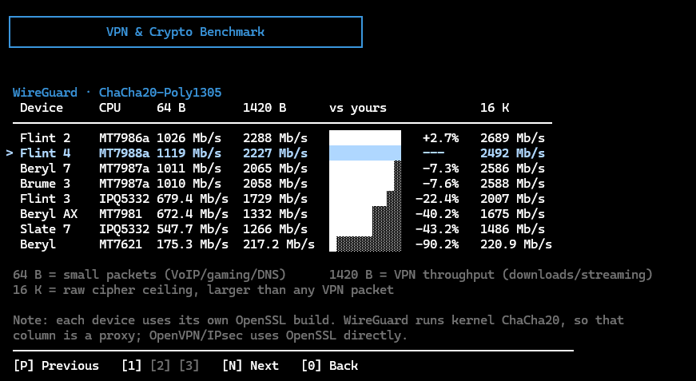

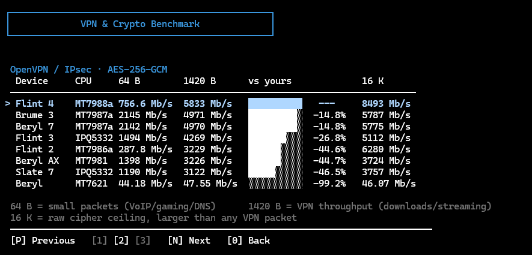

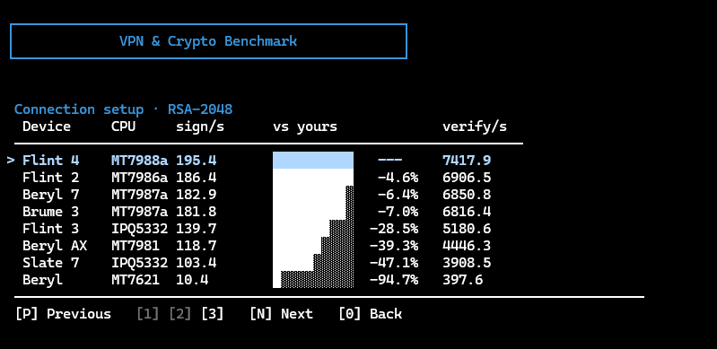

What these say, honestly:

- **AES-256-GCM is where the Flint 4 clearly pulls ahead.** At 1,420-byte packets (the size that corresponds to downloads and streaming) it manages 5.8 Gbit/s against the Flint 2's 3.2, and it tops the tool's table. That's good news for OpenVPN and IPsec users. At 64-byte packets it's still 2.6× the Flint 2 but sits below most of the other routers in the tool's table (only the Flint 2 and the oldest model are lower) — the kind of small-packet figure most sensitive to each device's OpenSSL build, but worth knowing if your traffic is dominated by tiny packets.
- **WireGuard's cipher, ChaCha20, is about level with the Flint 2.** In software the two routers land within a few percent of each other at 1,420 bytes (2,227 vs 2,288 Mb/s). Two things follow. It fits what Section 7 saw — a single tunnel pinning one core — with roughly 2.2 Gbit/s as the ceiling at that packet size. And it means the Flint 4's roughly 2× lead in the ProtonVPN test isn't coming from a faster cipher core. The benchmark is a proxy for the kernel's WireGuard, so I wouldn't push this further than "the advantage presumably comes from elsewhere in the packet path".
- **Storage is the other big step up**, at nearly three times the Flint 2's write speed.

**Methodology and limitations for this section**

- **VPN-tunneled throughput** is covered in Section 7 (ProtonVPN: 1,435.82/1,495.21 Mbps on Flint 4 vs 762.42/888.76 Mbps on Flint 2). An iperf3 test through the site-to-site GT-AX11000 tunnel wasn't part of the original run — that link is capped at 500/500 Mbps on its own WAN in another country, so it measures the GT-AX11000's connection ceiling more than the Flint 4. It has since been run, and is written up with the tunnel-MTU finding in Section 7.
- **Link ceilings**: every throughput test here ran over 2.5G-capped links (both the PC and the Flint 2 top out at 2.5G), against a 2 Gbps WAN. So the LAN figures show inter-port switching and CPU capacity independent of WAN speed, while the WAN figures are bounded by the ISP connection rather than the router. **The 10G ports and the SFP+ cage went untested** — there was no 10G-capable device on hand.
- **No stock baseline** exists (Section 5), so all figures reflect the router as configured for daily use.
- **Network Acceleration** was enabled throughout. The admin panel warns that Client Speed/Traffic Statistics become unreliable while it's on, which is precisely why iperf3 and Ookla were used rather than the router's own reported stats.

---

## 9. Wi-Fi 7 Performance

*All Wi-Fi measurements in this section were taken on firmware 4.9.1.*

The Wireless page shows Multi-Link Operation (MLO) status alongside the main network SSIDs and QR codes for each band:

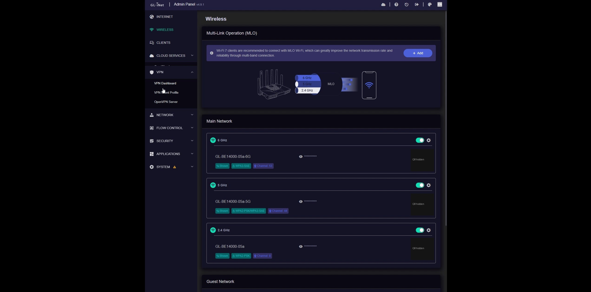

The LuCI side gives a more detailed per-radio breakdown (BSSIDs masked below), showing all three MT7990 radios (2.4/5/6GHz) and their configured interfaces:

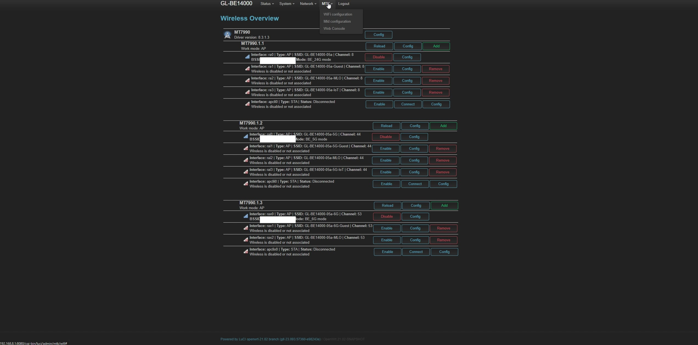

**Test client: Intel BE200 (genuine Wi-Fi 7, 6GHz + MLO capable)**

Connected via the gaming PC's Intel BE200 adapter — this machine runs on Wi-Fi rather than wired, so these are real daily-use conditions rather than a test rig. `netsh wlan show interfaces` confirms a proper Wi-Fi 7 negotiation:

- **Radio type:** 802.11be
- **Band/Channel:** 6GHz, Channel 37, **320MHz** width — the maximum Wi-Fi 7 supports, and notably not all router/client combinations manage to land here even when both sides claim Wi-Fi 7 support
- **Signal:** RSSI -25, 99% — strong, close-range connection
- **Security:** WPA3-Personal (H2E), negotiated cleanly

This test was run with MLO **off** — a true MLO on/off comparison is still outstanding (see notes below).

**Real-world throughput: ~1.8–1.9 Gbit/s in both directions**

- **Ookla Speedtest over Wi-Fi:** 1,907.20 Mbps down / 1,805.00 Mbps up

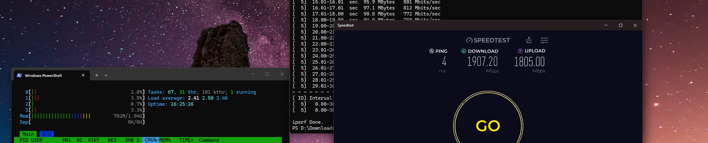

- **iperf3, Flint 4 → client (reverse mode):** 1.82 Gbit/s sustained over 30s, 0 retransmits


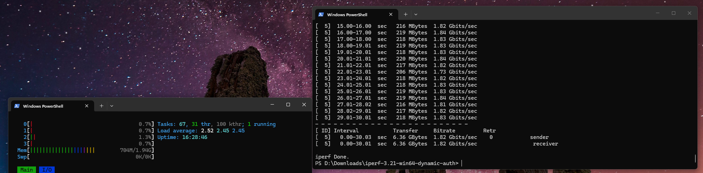

Two different tools landing within ~5% of each other is good corroboration that this Wi-Fi 7 link delivers close to **2 Gbit/s real-world throughput**. One important qualifier, though: the Speedtest figure runs over the 2 Gbps WAN, so it is bounded by the internet connection and can't show anything above ~1.9 Gbps no matter how fast the radio is. The **iperf3 result (1.82 Gbit/s, LAN-local, 0 retransmits) is the one that actually measures the Wi-Fi link** — that it nearly matches the WAN-capped Speedtest tells us the radio can saturate a 2 Gbps connection, not that the two tests independently found the same ceiling. For a wireless client, still an excellent result.

**A brief detour: iperf3's upload numbers looked wrong, and it's worth explaining why**

Initial testing showed a large asymmetry — iperf3 client-to-server (PC uploading to Flint 4) measured only 713–812 Mbit/s single-stream, dropping to 608–611 Mbit/s with 4 parallel streams. Read in isolation, that would suggest a real upload bottleneck. But the Speedtest result above (1,805 Mbps upload, same link, same client) rules that out immediately — the connection is clearly capable of far more than iperf3 measured in that direction.

The likely explanation: **iperf3's Windows build is a comparatively weak TCP sender**, historically less optimized for high-throughput multi-threaded transmission than Ookla's client, which uses several tuned parallel connections specifically engineered to saturate fast links. When Flint 4 was made the sender instead (reverse mode), the exact same tool immediately produced a clean 1.82 Gbit/s — strongly suggesting the bottleneck lived in the PC-side iperf3 process, not the router or the Wi-Fi link itself. Parallel streams made it worse rather than better in the upload direction too, consistent with a client-side tool limitation rather than a genuine link problem.

*(Update: this theory turned out to be incomplete — see the wired-to-wireless test further down, which points to a more precise explanation.)*

Worth stating plainly either way: this isn't a Flint 4 weakness. It's a reminder that any single tool can mislead if trusted in isolation — cross-checking with a second method (and, as it turned out, a third) is what actually revealed the true, strong result.

**MLO on vs. off — a real, reproducible finding**

With MLO off, the connection ran on a single 6GHz link. Enabling MLO on the Flint 4 (Wireless page → Multi-Link Operation → 5GHz + 6GHz) and reconnecting to the dedicated MLO SSID confirmed genuine dual-link operation via `netsh wlan show interfaces` — two active `LinkID` entries, one on 6GHz (channel 37, 320MHz) and one on 5GHz (channel 100, 160MHz), both properly connected.

Running the identical single-stream reverse-mode test (the same method that produced the clean 1.82 Gbit/s / 0-retransmit MLO-off baseline) twice with MLO active:

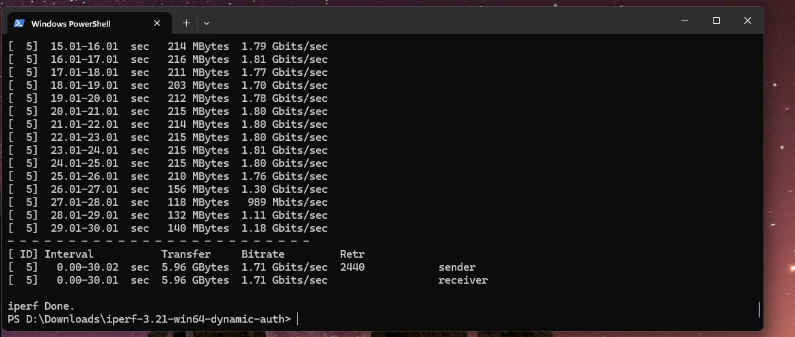

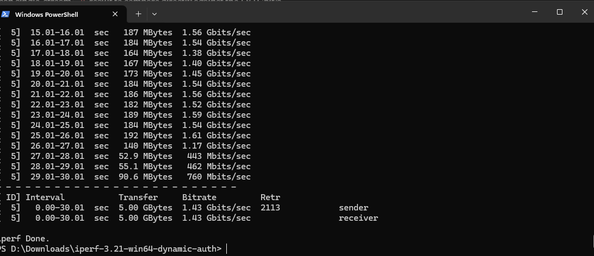

| | MLO off | MLO on (run 1) | MLO on (run 2) |
|---|---|---|---|
| Average throughput | 1.82 Gbit/s | 1.71 Gbit/s | 1.43 Gbit/s |
| Retransmits | 0 | 2,440 | 2,113 |
| Late-test dip | None | ~989 Mbit/s | ~443 Mbit/s |

Both MLO runs were slower than the single-link baseline and introduced thousands of retransmits where the single-link test had zero. More notably, **both runs degraded sharply at almost the same point — around the 26–27 second mark** — before partially recovering. That timing consistency across two independent runs argues against random interference (which wouldn't reliably hit the same moment twice) and points instead toward something systematic in how MLO manages the two links — a periodic link-quality reassessment or rebalancing cycle is a plausible cause, though this wasn't confirmed at the driver level.

A parallel-stream test under MLO also came in low (~601–623 Mbit/s). At this point in testing that looked like parallel streams hurting Wi-Fi throughput generally — but the later wired-to-wireless tests disprove that (4 parallel streams hit 2.34–2.35 Gbit/s cleanly on a single 6GHz link), so this result belongs to MLO specifically, not to parallel streams as such:

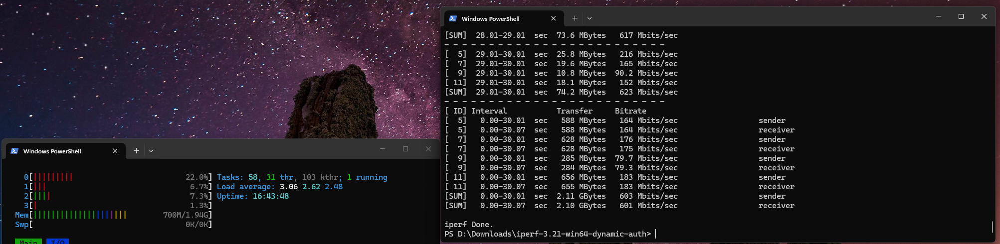

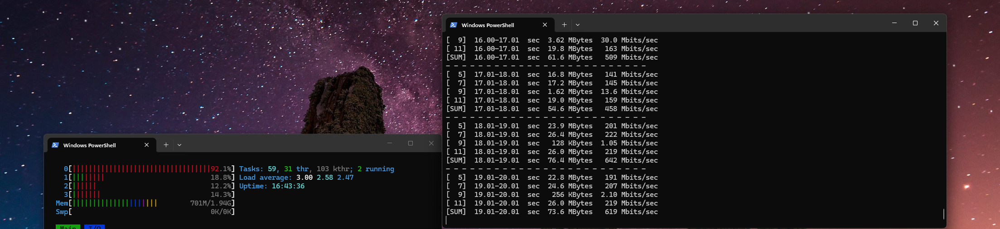

**Bottom line for this section:** on this router/client/firmware combination, at time of testing, enabling MLO measurably *hurt* both throughput and stability compared to a strong single 6GHz link, despite both links reporting as properly connected. This is worth stating as a genuine finding rather than glossing over — Wi-Fi 7 and MLO are still young technology across the industry, and this kind of real-world result is exactly the kind of thing a spec sheet won't tell readers. It doesn't mean the Flint 4's Wi-Fi 7 implementation is bad — the single-link 6GHz performance was excellent — but MLO specifically doesn't appear ready to deliver a benefit yet, at least not for a single high-throughput client in this configuration.

**Signal strength: Flint 4 vs. Flint 2, side by side**

With both routers placed next to each other and the PC in a fixed location, a Wi-Fi spectrum analyzer gives a reasonably controlled comparison — same distance, same environment, same moment. Two captures at 2.4GHz:

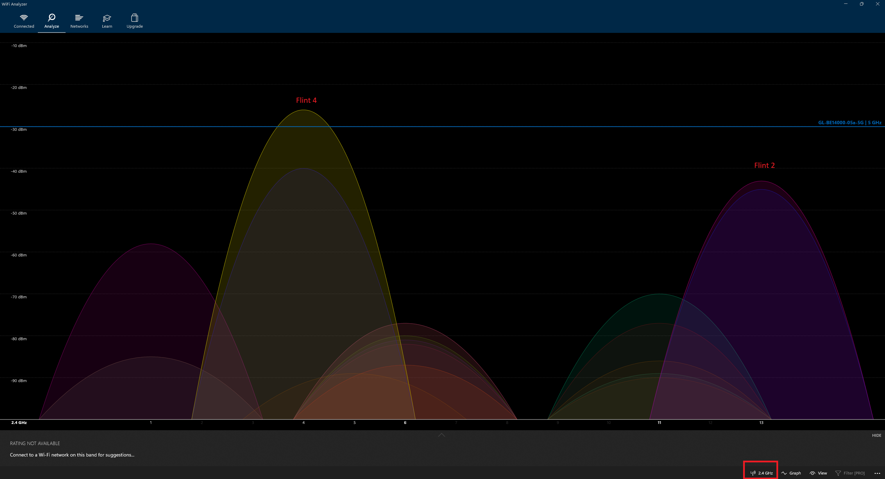

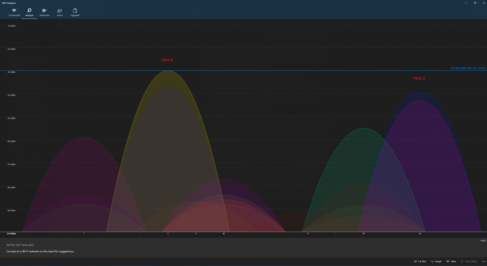

5GHz:

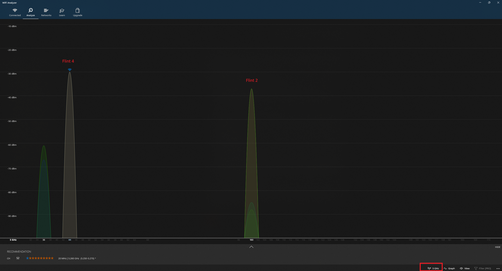

6GHz:

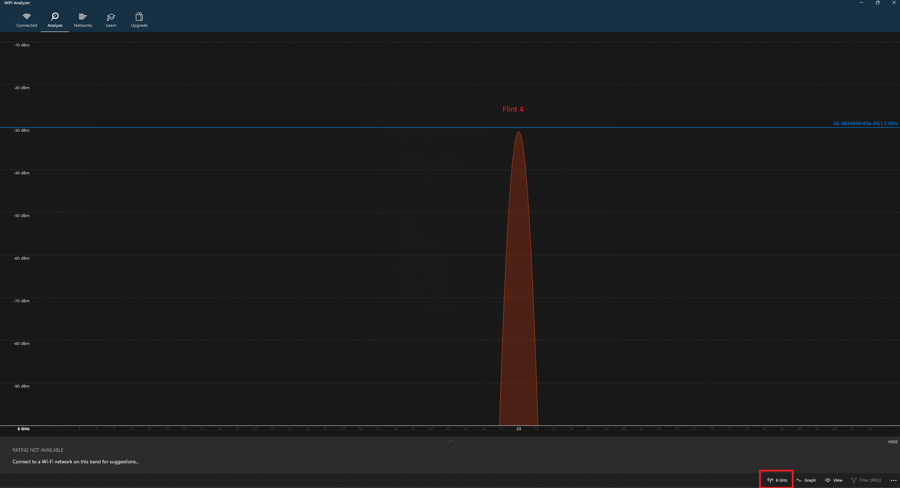

| Band | Flint 4 | Flint 2 |
|---|---|---|
| 2.4GHz | ~-28 dBm (channel 4) | ~-38 to -40 dBm (channel 11–13) |
| 5GHz | ~-30 dBm (channel 44) | ~-38 dBm (channel 100) |
| 6GHz | ~-28 dBm (channel 53) | *not present — Flint 2 is Wi-Fi 6, no 6GHz radio* |

Flint 4 shows a consistent ~10 dB advantage over Flint 2 on both shared bands — roughly ten times the received power, from the same spot. That likely reflects real differences in antenna design and transmit power between the two generations (6 antennas vs. 4, per Section 3).

**Two honest caveats on this comparison**, because "only the router differs" isn't quite true here:

1. The routers weren't on matched channels. At 2.4GHz it's channel 4 vs channels 11–13; at 5GHz it's channel 44 (UNII-1) vs channel 100 (UNII-2C/DFS). Channel 100 is both higher in frequency — so slightly more path loss — and frequently subject to a lower permitted EIRP than UNII-1. Some of that 10 dB is band position, not hardware.
2. Transmit power wasn't equalised between the two routers, and neither was verified as running at the same setting.

So: directionally a real advantage, and consistent across bands, but treat "10 dB" as an upper bound rather than a clean like-for-like figure. A rerun with both radios pinned to the same channel and the same TX power would tighten it considerably.

One practical takeaway: the analyzer's channel-recommendation engine picked **channel 52** as the best available 5GHz choice (9-star rating) in this environment — worth applying if the router isn't already there.

**Wired-to-wireless throughput — tested with MLO active, and a correction to the earlier theory**

One more set of tests: Void2 (Flint 2), connected only via wired LAN to Flint 4 (its own Wi-Fi radio is off), exchanging traffic with the PC over Flint 4's Wi-Fi — a wired-to-wireless bridge through the router, rather than either endpoint being wireless-to-wireless or CPU-terminated. **All four tests below were run with the PC connected via MLO** (the same 5+6GHz connection from the section above), not the single-link 6GHz baseline — worth keeping in mind since MLO itself already showed instability under certain conditions.

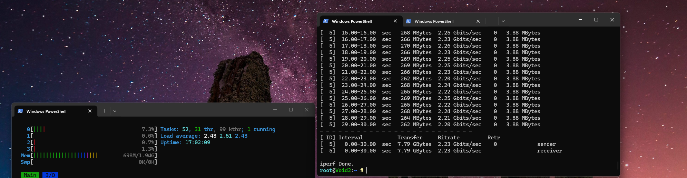

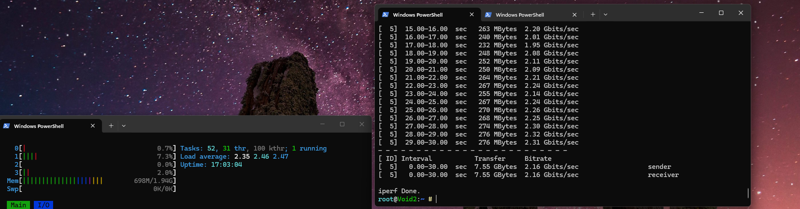

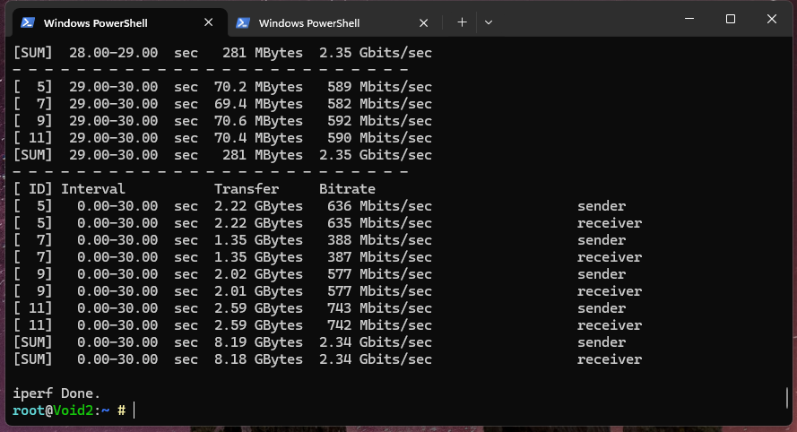

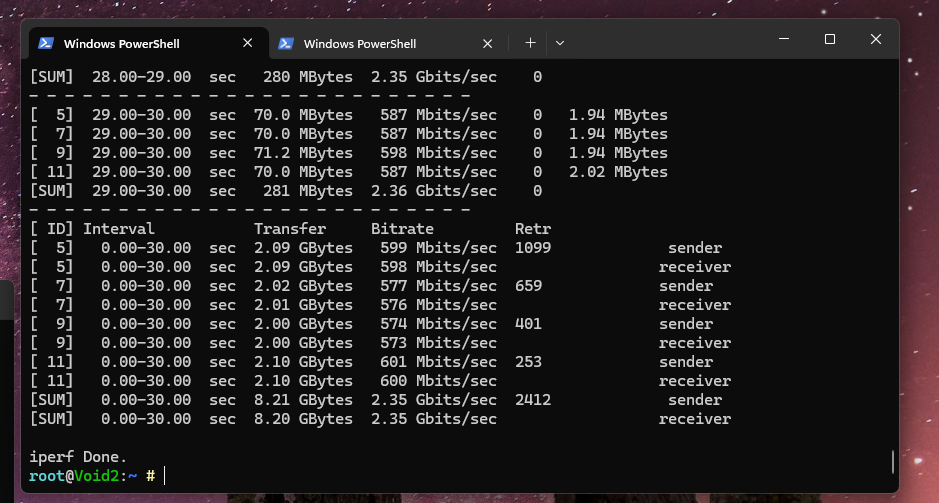

| Test | Direction | Streams | Result | Retransmits |
|---|---|---|---|---|
| Run 1 | Void2 → PC | Single | 2.23 Gbit/s | 0 |
| Run 2 (reverse) | PC → Void2 | Single | 2.16 Gbit/s | 0 |
| Run 3 (reverse) | PC → Void2 | 4 parallel | 2.34 Gbit/s | not confirmed clean |
| Run 4 | Void2 → PC | 4 parallel | 2.35 Gbit/s | **2,412** |

Run 2 stands out on its own: it's the Windows PC acting as sender again — the exact scenario that looked weak earlier in this section (713–812 Mbit/s) — but here it's clean and fast. That directly contradicts the "Windows iperf3 is a weak sender" theory from earlier, so that theory needs correcting: the real variable isn't which OS sends, it's whether Flint 4's own CPU is the one *receiving* traffic as a local process. Every bridged test (Flint 4 not an endpoint) beat the CPU-terminated-receiving result, regardless of which side sent. That much lines up cleanly with the Section 8 finding.

**But Run 4 complicates the picture — or did, until one more control test resolved it.** Same bridged, non-CPU-terminated category as Runs 1–3, same throughput ballpark (2.35 Gbit/s) — but 2,412 retransmits. Repeating that exact same test — Void2 → PC, 4 parallel streams, Flint 4 transmitting out over Wi-Fi — but with MLO switched **off** (back to the single 6GHz link) gave a dramatically different result:

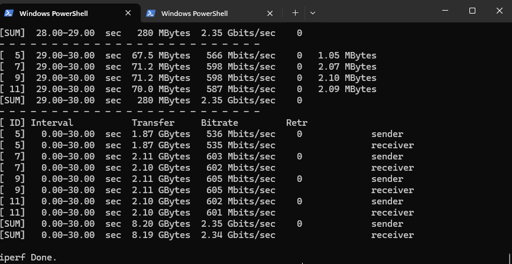

**8.20 GB, 2.34–2.35 Gbit/s, 0 retransmits — every single stream clean.** Identical test, identical throughput, only variable changed was MLO. That isolates it precisely: the instability isn't about parallel streams in general, and it isn't about bridged vs. CPU-terminated traffic — **it's specifically MLO itself introducing retransmits under multi-stream transmit load**, something a single 6GHz link simply doesn't do.

**Resolved summary — corrected**

An earlier draft of this conclusion overstated how resolved things were, so worth being precise here. What's **solidly proven**, via a clean isolated A/B control: parallel-stream traffic under MLO produces retransmits (2,412 in Run 4) that vanish completely with MLO off (0 retransmits, identical test, identical throughput). That comparison is airtight.

What's **not** fully explained by that control alone: the very first MLO test in this section — Flint 4's own CPU sending single-stream via reverse mode — was also unstable (2,440 / 2,113 retransmits, late-test dips), while the bridged single-stream tests here (Runs 1 and 2) were both completely clean, in both directions. So single-stream results under MLO were inconsistent depending on whether Flint 4's CPU was the traffic's source, and that inconsistency isn't resolved by the parallel-stream control test — that test only isolated the parallel-stream case.

Laying out all five MLO data points together, the pattern that actually fits every result: **instability appeared whenever traffic was either CPU-terminated (regardless of stream count) or used parallel streams (regardless of endpoint) — bridged, single-stream traffic was the only category that stayed clean across every test.** That's inferred from the available data rather than confirmed with its own dedicated control test the way the parallel-stream finding was, so it's offered as the best-supported explanation rather than a fully proven one.

Either way, the headline conclusion holds: **MLO, on this router/client/firmware combination, is measurably less stable than a single strong 6GHz link** under multiple real conditions (CPU-terminated traffic, and parallel-stream traffic specifically confirmed via control test). Single-link 6GHz Wi-Fi 7 performance on the Flint 4 is excellent and solid throughout every test in this section; MLO specifically isn't yet delivering a benefit, and introduces real instability under some — not all — traffic patterns. One caveat on attribution: every MLO test in this section ran on the same client, the PC's Intel BE200, so these results can't yet separate a Flint 4 firmware issue from a BE200 driver one. A second genuine Wi-Fi 7 client — the Galaxy S25 Ultra used in the range test below — is available here and simply hasn't been put through the MLO runs yet. That's the obvious way to settle it, and it's on the list.

For completeness, the reverse direction on 6GHz-only (PC → Void2, 4 parallel streams) was equally clean:

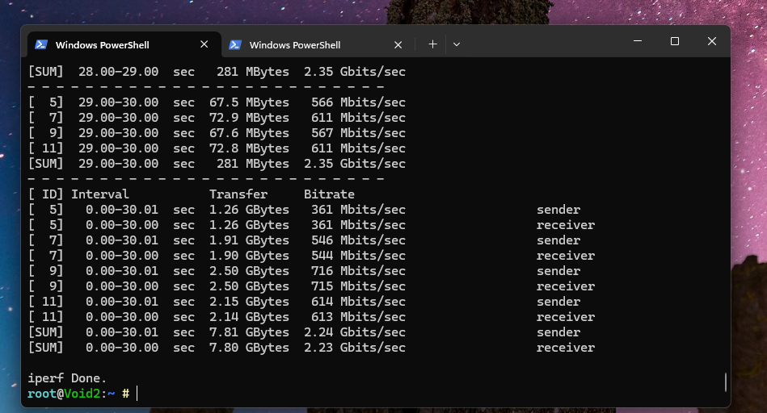

**2.23–2.24 Gbit/s.** That closes out the full matrix — every single-link 6GHz test, in both directions, single-stream and parallel, came back clean. MLO was the only condition that ever produced retransmits or instability, across every traffic pattern tested.

**Range test: Samsung Galaxy S25 Ultra, three locations**

A separate real-world range test using the phone's Speedtest app. The S25 Ultra is a genuine Wi-Fi 7 client in its own right, but a different device with a different Wi-Fi chipset from the PC's Intel BE200 — so treat this as its own independent data point rather than a direct continuation of the numbers above:

| Location | Download | Upload | Ping | Jitter |
|---|---|---|---|---|
| Same room as router | 1,899 Mbps | 1,676 Mbps | 6ms | 1ms |
| Adjacent room, one wall | 1,854 Mbps | 1,695 Mbps | 5ms | 1ms |
| Different floor | 1,893 Mbps | 1,555 Mbps | 6ms | 0ms |
| Furthest room, second floor | 1,863 Mbps | 1,503 Mbps | 5ms | 0ms |


The headline is how *little* these numbers move, even at the worst-case spot in the house. Download never dropped below 1,854 Mbps at any location; the furthest room on the second floor still hit 1,863 Mbps. Upload shows the only real trend, declining with distance and obstruction: 1,676–1,695 Mbps at close range down to 1,503 Mbps at the furthest point, a ~11% drop. Ping stayed at 5–6ms everywhere and jitter never exceeded 1ms.

**What this test can and cannot tell you.** Speedtest measures through the internet connection, and that connection is 2 Gbps — the direct-WAN wired result in Section 8 was 1,901.91 Mbps, essentially the same number as the best result in this table. Every download figure above is therefore sitting on the WAN ceiling, not the Wi-Fi ceiling. The correct reading is *"6GHz still saturates a 2 Gbps internet connection from the furthest room in the house"* — which is useful to know, and is what most people actually care about — but it is **not** a measurement of how much Wi-Fi headroom remains at distance. The link could be at 4 Gbps in the same room and 1.95 Gbps upstairs and this test would show both as ~1.9. The upload column, which does move, is the only part of this table showing real degradation.

A proper range curve would need LAN-local iperf3 runs at each location, unbounded by the WAN — worth doing as a follow-up.

Combined with the signal-strength comparison above, the practical conclusion still holds: coverage across a normal house is strong enough that a single Flint 4 saturates a 2 Gbps line everywhere in it, and most setups this size shouldn't need mesh or extenders.

---

## 10. Daily-Driver / Long-Term Notes

**First real status check-in, ~20 hours in**

LuCI's Status Overview, now fully configured and running as the daily-driver router:

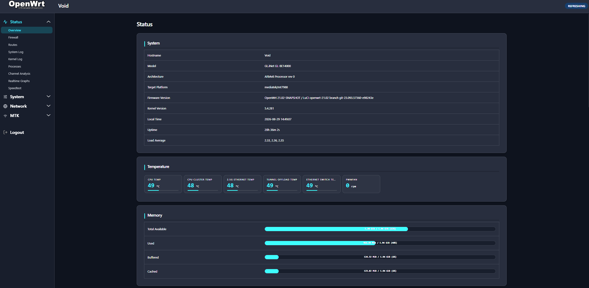

A few things worth noting from this:

- **Uptime: 20h 36m 2s** — no unexpected reboots since setup, a reasonable early signal for stability (too early to call this conclusively, but a clean start)
- **Load average: 2.33, 2.36, 2.35** — consistent with the figure seen throughout every test in this review (Sections 7–9 all landed in the same 2.3-something range), so this is the router's normal resting state rather than anything elevated by testing. One curiosity worth noting for anyone reading the numbers closely: ~2.35 is high for an idle four-core box, yet CPU utilisation sits near zero in the same captures. On Linux that combination usually means threads parked in uninterruptible sleep rather than actual CPU demand — common enough on embedded platforms with busy driver or offload threads, and it costs nothing in measured throughput here. The practical upshot is just that **load average isn't a meaningful signal on this router**, so the load-average figures quoted elsewhere in this review should be read as context rather than measurement. The six-day check-in further down settles it: load average 2.29 / 2.31 / 2.33 sitting alongside **2% CPU usage**, with a peak of only 18.4% across an entire week. Whatever is keeping that figure at 2.3, it is not the CPU doing work. Something to poke at with `ps` state flags on a future pass out of interest, not concern. *(Update: on the 4.11 beta the resting load average is **0.24 / 0.27 / 0.26** — roughly a tenth of the 4.9.1 figure on the same hardware. That fits the uninterruptible-sleep explanation above, since the kernel moved from 5.4 to 6.12, though I haven't isolated the cause. Load figures from the 4.11 runs are therefore much more meaningful than the 4.9.1 ones.)*
- **Memory: 1.20 GiB / 1.94 GiB used (62%)** — a healthy chunk of the 2GB used under real daily-driver conditions (VLANs, WireGuard, Wi-Fi, DNS, etc. all active), though nowhere near maxed out
- **Temperatures, first data point for this review:** CPU 49°C, CPU Cluster 48°C, 2.5G Ethernet 48°C, Tunnel Offload 49°C, Ethernet Switch 49°C, fan at 0 RPM — all sitting comfortably in the high-40s with the fan not even needing to spin up, a good sign for passive thermal headroom under normal conditions
- **Platform confirmed directly from the OS**, not just the spec sheet: `mediatek/mt7988`, ARMv8, matching what Section 3 established from GL.iNet's documentation — nice to see it verified live rather than just taken on faith
- **Firmware**: OpenWrt 21.02-SNAPSHOT / LuCI openwrt-21.02 branch, kernel 5.4.281 — worth tracking whether this changes across firmware updates during the review period. *(Update: it has — the router now runs an OpenWrt 25.12 base on Linux 6.12; see Section 11.)*

**AdGuard Home, real usage after daily-driver time**

Blocklists configured — the HaGeZi suite plus one additional list, all updated same-day:

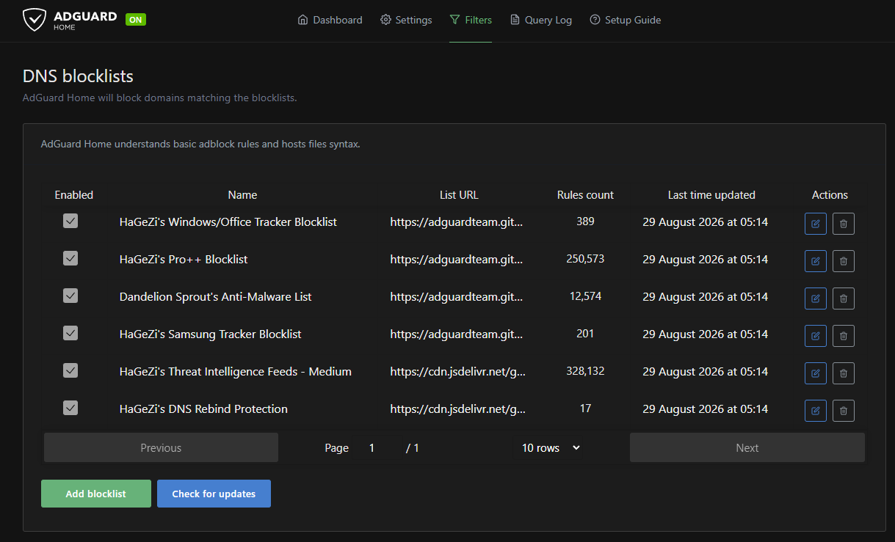

| List | Rules |
|---|---|
| HaGeZi's Windows/Office Tracker Blocklist | 389 |
| HaGeZi's Pro++ Blocklist | 250,573 |
| Dandelion Sprout's Anti-Malware List | 12,574 |
| HaGeZi's Samsung Tracker Blocklist | 201 |
| HaGeZi's Threat Intelligence Feeds - Medium | 328,132 |
| HaGeZi's DNS Rebind Protection | 17 |

That's just under 592,000 combined blocklist rules active. Dashboard stats, captured at the same point as the LuCI status check above — worth noting AdGuard Home's dashboard defaults to a "last 7 days" label regardless of actual uptime, but the router had only been running for ~20 hours at this point, so these numbers reflect that ~20-hour window, not a genuine 7-day sample:

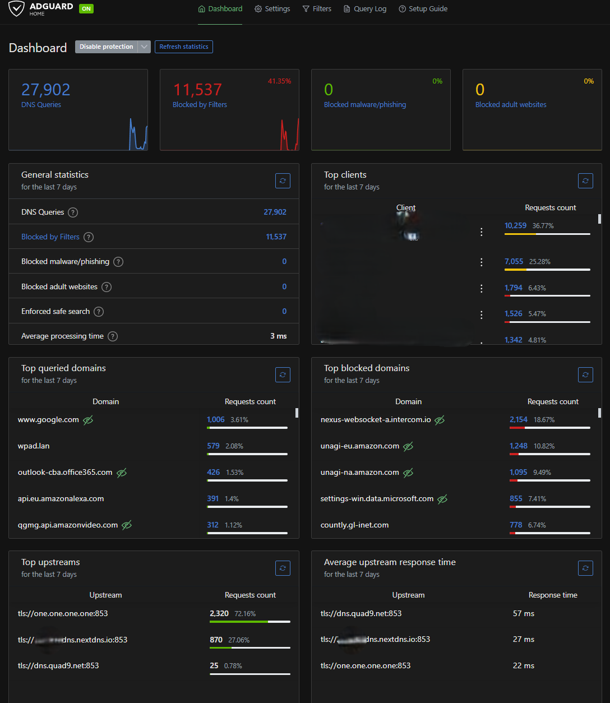

- **27,902 DNS queries** in the first ~20 hours of uptime, **11,537 blocked (41.35%)** — a substantial filtering rate, though worth reading in context: 0 of those were malware/phishing blocks and 0 were adult-content blocks. The blocking is almost entirely tracker/telemetry-driven rather than security-driven, which lines up with the top blocked domains shown: Intercom's websocket tracker, two Amazon tracking subdomains, Microsoft telemetry, and GL.iNet's own analytics domain (`countly.gl-inet.com`) — GL.iNet's own router phoning home to their analytics is itself an interesting, slightly ironic catch from running your own DNS filtering.
- **Average processing time: 3ms** — DNS resolution overhead from AdGuard Home's filtering is effectively unnoticeable.
- **Upstream DoT providers**: Cloudflare (`one.one.one.one`) handling the majority (72.16%), NextDNS as secondary (27.06%), Quad9 barely used (0.78%) — matches the "DNS-over-TLS upstreams" setup described in the intro, now confirmed with real traffic distribution. Average response times track that split sensibly: Cloudflare fastest at 22ms, NextDNS at 27ms, Quad9 trailing at 57ms on its handful of queries.
- **Top queried domains** are unremarkable and expected for a real household network: Google, Outlook/Office 365, Amazon Alexa, Amazon Video — nothing surprising, which is itself a reasonable sanity check that filtering isn't overreaching into normal traffic.

Note: AdGuard Home's statistics retention here is capped at 7 days, so the early snapshot above can't be recovered retroactively once the window rolls over. A genuine full-week capture follows below.

**AdGuard Home — the real 7-day picture**

With a full retention window now accumulated, this is the representative figure rather than the extrapolated one:

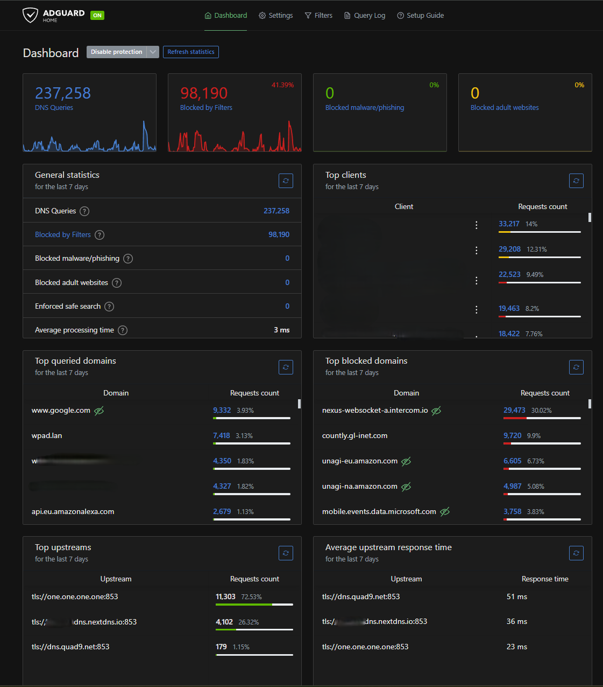

| Metric | 7-day total |
|---|---|
| DNS queries | **237,258** |
| Blocked by filters | **98,190 (41.39%)** |
| Blocked malware/phishing | 0 |
| Blocked adult websites | 0 |
| Average processing time | **3 ms** |

The headline number barely moved: **41.39% over a full week against 41.35% in the first ~20 hours.** For a filtering setup to land within four hundredths of a percent of its early reading, across a 10x larger sample, says the early snapshot was representative rather than lucky — and that household DNS traffic is far more predictable in composition than it feels. (The 48.50% shown on the LCD mid-week was a genuine reading of a busier stretch, not a contradiction; it simply averaged back down.)

Still 0 malware/phishing and 0 adult-content blocks across a quarter of a million queries, which confirms the earlier reading: this filtering is doing tracker and telemetry work, not security work. The top blocked domains bear that out — Intercom's websocket tracker alone accounts for **29,473 blocks (30% of everything blocked)**, followed by `countly.gl-inet.com` at **9,720**, then Amazon's `unagi` tracking endpoints and Microsoft telemetry. GL.iNet's own analytics domain holding second place on a GL.iNet router remains the most quietly amusing result in this review.

**Upstream performance over the week**, which also corrects a detail worth being precise about — Cloudflare is the fastest of the three, not merely the busiest:

| Upstream | Share of upstream queries | Avg response |
|---|---|---|
| Cloudflare (`one.one.one.one`) | 72.53% | **23 ms** |
| NextDNS | 26.32% | 36 ms |
| Quad9 | 1.15% | 51 ms |

One detail worth drawing out: only about **15,600 queries actually reached an upstream resolver** out of 237,258 total. Subtract the 98,190 blocked outright and the overwhelming majority of what remained was served from AdGuard's own cache. That is why the 3 ms average processing time holds up — most lookups never leave the router at all, and DNS-over-TLS latency is only being paid on a small minority of traffic.

**Bugs and rough edges found**

The two real ones are documented in full elsewhere rather than repeated here: the cross-port forwarding/CPU-termination asymmetry (Section 8) and the MLO instability under parallel-stream and CPU-terminated load (Section 9). Both were isolated with control tests.

Neither has been filed with GL.iNet as a support ticket. To be clear about why: both are behavioural characteristics reproducible on demand rather than faults breaking normal use, and the review itself is the more useful form for them to take — the findings are here in full, with methodology, for GL.iNet and anyone else to reproduce.

**Support/community responsiveness**

Never needed to reach out for actual troubleshooting or support during this review — everything worked out of the box or was resolved through the router's own diagnostics. Did report two potential issues directly to GL.iNet during earlier work with the Creator Program, but both turned out, after investigation, not to be genuine GL.iNet-side bugs. Worth being upfront about that rather than implying more support contact happened than actually did.

**Power consumption**

Covered fully in Section 3 — the real Tapo-measured baseline (~12.6W average, roughly half the spec sheet's claimed ceiling) already tells the story. Nothing further to add here.

**The physical display, actually in use**

Section 4 mentioned the Flint 4's 2.4-inch touchscreen and its Display Management settings page — worth showing it doing its job rather than just describing the settings. It's genuinely responsive to touch, not the sluggish afterthought these panels often are, and a good deal is configurable directly from the screen itself rather than only from the admin panel. Three screens from it, cycling through live stats:

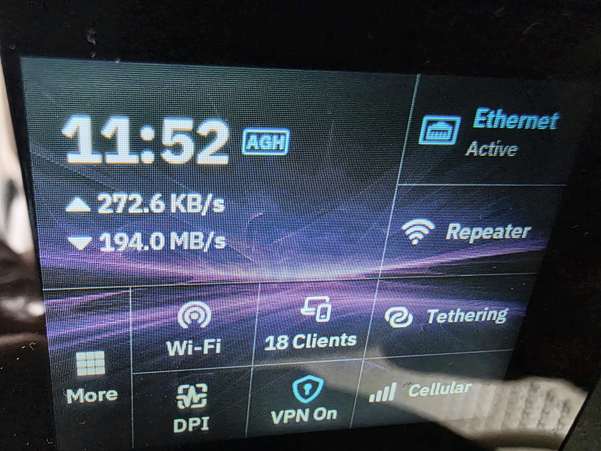

The home screen: live throughput (272.6 KB/s up / 194.0 MB/s down at the moment of capture — a real burst of activity, not idle), 18 connected clients, Ethernet active, VPN on, and quick-access tiles for Wi-Fi, DPI, Repeater, Tethering, and Cellular.

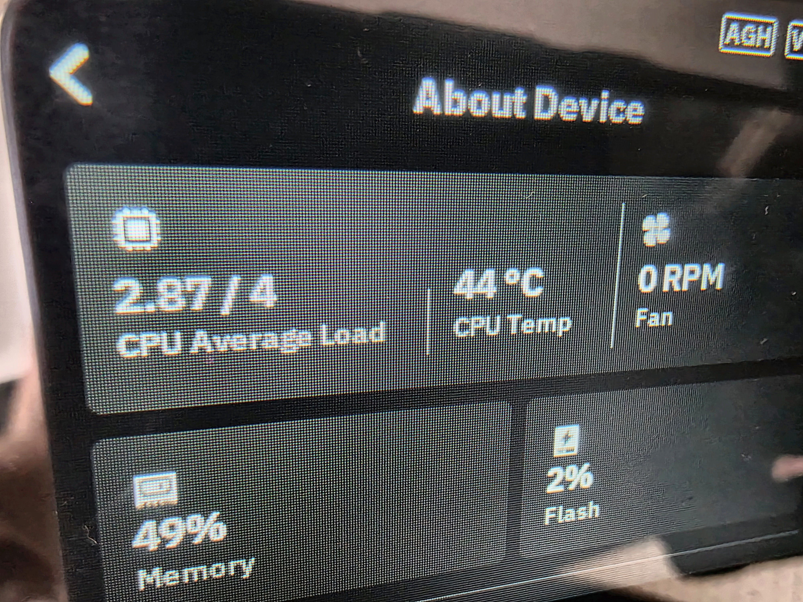

An "About Device" screen: CPU average load 2.87/4 (right in line with everything measured throughout this review), CPU temp 44°C, fan at 0 RPM, memory at 49%, flash at 2%.

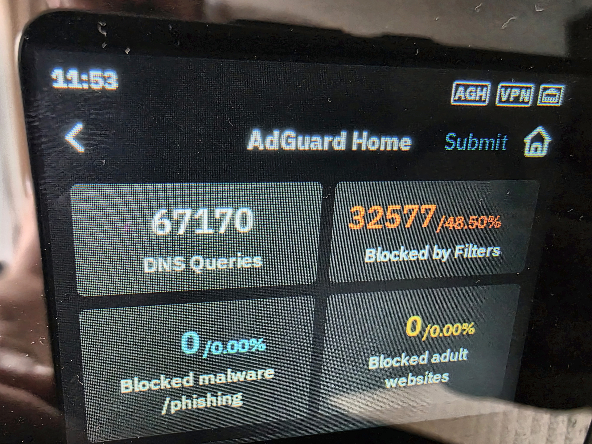

And — a useful surprise — **AdGuard Home has its own dedicated screen on the physical display**: 67,170 DNS queries, 32,577 blocked (48.50%). This was a mid-week reading, taken between the ~20-hour snapshot (27,902 queries / 41.35%) and the full 7-day figure above (237,258 queries / 41.39%) — a busier-than-average stretch that later settled back to the long-run rate.

**Six days in — the longer view**

A second check-in, this time with real accumulated history behind it rather than a 20-hour snapshot. (The 30-day temperature and resource history comes from `luci-app-temp-history`, a LuCI package I maintain — the stock firmware doesn't retain this data on its own.)

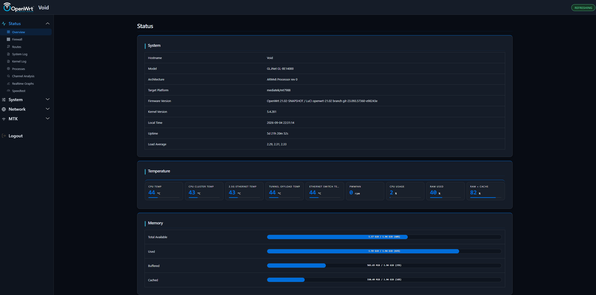

- **Uptime: 5d 21h 20m**, and this time it means something. The uptime graph below marks reboots with red dashes, and the only ones in the whole window are from the initial setup period at the end of August. Since then there has been **not a single unscheduled reboot** — the next one due is tomorrow's scheduled weekly crontab reboot, which will bring this run in at a clean seven days.
- **Memory: 40% RAM used** (82% counting buffers and cache), ranging between 38.5% and 42.1% across the period. Flat over six days of daily-driver use — no upward creep, which is the thing you actually want to see from a router running AdGuard Home, WireGuard and VLANs continuously.
- **CPU usage: 2%**, averaging 2.0% today and peaking at just 18.4% across the entire week. This router simply never gets busy under a normal household load.

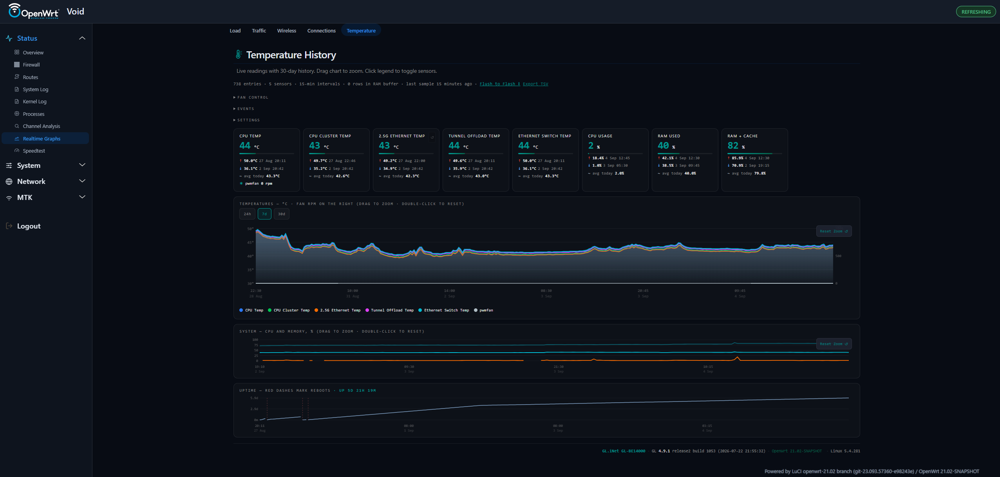

**Thermals over the full window — 738 samples, 5 sensors, 15-minute intervals:**

| Sensor | Current | Period max | Period min | Avg today |
|---|---|---|---|---|
| CPU | 44°C | 50.0°C | 36.1°C | 43.3°C |
| CPU Cluster | 43°C | 49.7°C | 35.2°C | 42.6°C |
| 2.5G Ethernet | 43°C | 49.2°C | 34.9°C | 42.3°C |
| Tunnel Offload | 44°C | 49.6°C | 35.9°C | 43.0°C |
| Ethernet Switch | 44°C | 50.0°C | 36.1°C | 43.3°C |

Two things stand out. The all-time peak across every sensor is **exactly 50.0°C**, recorded on 27 August during the heaviest testing in this review — so the throughput and VPN work in Sections 7–9 represents the hottest this router has ever run, and it still didn't reach 51°C. And **the fan has never spun**: 0 RPM across all 738 samples, under every load this review threw at it. Passive cooling on this chassis is not marginal, it's comfortable, and in practice the Flint 4 is a silent device.

The wider trace also shows temperatures *settling* over time rather than climbing — the high-40s readings cluster around the late-August test period, with the last several days sitting steadily in the low 40s.

**Running summary**

- **Thermals** — 36–50°C across every sensor over 738 samples, all-time peak of 50.0°C during this review's own heaviest testing, and the fan has never once spun up. Section 8's 15-minute sustained WAN transfer sat at 43–44°C, comfortably mid-range for the period.
- **Stability** — a weekly crontab reboot means raw uptime isn't the signal here; *unscheduled* reboots are, and the reboot-marked uptime history shows **none at all** since the setup period ended. Nearly six days continuous at the latest check-in, with a full seven-day run completing at tomorrow's scheduled reboot. No crashes, no hangs, no unexplained restarts at any point in this review.

**Still outstanding**

- LAN-local iperf3 range measurements at each location, to replace the WAN-capped Speedtest range table in Section 9.
- The 30-second LAN, Wi-Fi 7 and range measurements in Sections 8–9, repeated on the 4.11 beta (the sustained iperf3 runs and the direct-WAN Ookla test are done).
- MLO retested on the Galaxy S25 Ultra, to separate Flint 4 firmware behaviour from the BE200's driver — and, now that the firmware has moved on (Section 11), on the 4.11 beta as well, since MLO is the part of the stack most likely to have changed.
- 10G and SFP+ port testing, once there's a 10G-capable device to test against.

---

## 11. Update: Moving to the 4.11 Beta Firmware (October 2026)

Everything above was measured on firmware 4.9.1. The Flint 4 now runs **GL.iNet 4.11.0 beta3, build 1153** (30 September 2026) — **OpenWrt 25.12-SNAPSHOT r32295+912 on Linux 6.12.94**. For anyone who likes this hardware for the OpenWrt side of it, that's the headline: the base moved from OpenWrt 21.02 on kernel 5.4 to a current OpenWrt on kernel 6.12, with firewall4 (nftables) and the `apk` package manager in place of the older fw3/opkg stack.

**How the move went.** Same approach as Section 5: the configuration was re-applied from scripts rather than imported from a backup, so it doubles as a check that the setup is reproducible. The reworked afraid.org updater from Section 5 (now at v3.0.0) runs on 4.11 and updates normally, and native dual-stack IPv6 works, with the main LAN receiving a slice of the ISP's delegated prefix.

**What carries over from the earlier sections.**

- **Network Acceleration** — GL.iNet's own toggle works on 4.11 as it did on 4.9.1, so the on/off comparison in Section 8 still describes the path the router runs in daily use.
- **WireGuard** — the 4.11 beta is where the CPU test from a device behind the router and the site-to-site throughput and MTU work in Section 7 were done.
- **Latency under load** — two LibreQoS bufferbloat runs on the beta graded A and A+ (+6.4 ms and +3.8 ms overall) with SQM off; details in Section 8.
- **On-router benchmarks** — storage, memory and crypto results, including how the Flint 4 compares with the Flint 2 and other GL.iNet routers, are in Section 8.
- **Fan and temperatures** — the 4.11 betas expose the fan as a standard Linux PWM cooling device and the temperature sensors through the normal hwmon interfaces, which makes monitoring simpler than before.

**Resting load average.** On 4.9.1 the router idled at a load of about 2.3 with the CPU near zero (Section 10); on the 4.11 beta it idles at about 0.25. Load figures on this router now track real work, which is why the sustained-run numbers in Section 8 are easier to read than the 4.9.1 ones.

The same LuCI Status page on the 4.11 beta, after a day and eight hours of uptime — OpenWrt 25.12-SNAPSHOT on Linux 6.12.94, a load average of 0.39 / 0.28 / 0.21, 41–42°C on every sensor, 4% CPU and 37% RAM used:


**A practical note for LuCI users.** On 4.11, the GL.iNet admin panel is where Wi-Fi and acceleration settings are managed. LuCI is still there and works well for everything else, but for those two areas I make changes in the GL.iNet panel rather than through LuCI's lower-level pages for the same settings.

**What hasn't been repeated.** The only parts of Sections 8–9 re-run on the beta are the sustained WAN transfer, in both directions, and the direct-WAN Ookla test (see the Section 8 update): upload held 1.68 Gbit/s, while single-stream download averaged 1.26 Gbit/s against ~1.56 on 4.9.1. Ookla's multi-stream test on the beta matched 4.9.1 (1,905.73 Mbps down / 1,817.92 up, against 1,901.91 / 1,760.96), so I read the iperf3 download gap as that one stream's path rather than the router, though one pair of tests can't prove it. Everything else in those sections — the 30-second LAN tests, Wi-Fi 7 and MLO — remains a 4.9.1 result. MLO in particular is exactly the kind of feature a new kernel and Wi-Fi driver stack can change, so the MLO findings in Section 9 describe 4.9.1, not necessarily where things stand today.

---

## 12. Final Verdict

**What it costs, and what that buys**

At the time of the original review (early September 2026), GL.iNet's own store listed the Flint 4 at a little over twice the Flint 2's price, with launch pricing starting at about 1.5× the Flint 2's (the "super early bird" tier) and stepping up through a couple of tiers towards list. Prices and currencies vary by region and move over time, so check the store before buying.

At its list price the Flint 4 is priced against mainstream Wi-Fi 7 routers from the big vendors, and against those the port layout is the unusual part: two independent 10G interfaces (RJ45 plus SFP+), four 2.5G ports, 2GB of RAM and 64GB of eMMC. Most consumer routers at this price give you a single 2.5G WAN port and call it multi-gig.

So the value case isn't really the Wi-Fi. It's that you're buying a small multi-gig switch, a 1.5 Gbps-capable VPN gateway, and an OpenWrt box with genuine room to run services on it, all in one chassis, at a price where competitors sell you a router with one fast port. Measured against the Flint 2 at under half the money, the honest framing is that the extra spend buys 10G capability, Wi-Fi 7 radios, double the RAM and eight times the storage. Whether that's worth it depends almost entirely on the next section — and at launch-tier pricing the calculation is a good deal easier than at full list.

**Who this is actually for**

The Flint 4 makes the most sense for people who can actually use what it adds over the Flint 2: a 2.5Gbps+ internet connection (or firm plans to get one), real Wi-Fi 7 client hardware, and the extra RAM/storage headroom of the newer Filogic 880 platform. The strong single-link 6GHz Wi-Fi 7 performance (Section 9) is a genuine, measurable upgrade for anyone with a compatible client device.

The Flint 2 remains perfectly capable for most other people too: anyone on a sub-2.5Gbps connection (the multi-gig ports simply won't be exercised), and anyone without a Wi-Fi 7 client device yet. Worth a small caveat from Section 9: MLO specifically showed some instability in testing (on 4.9.1 — not yet repeated on the 4.11 beta, which carries a newer kernel and Wi-Fi driver stack), so anyone buying primarily for that feature might want to wait and see how it matures — single-link Wi-Fi 7 performance, on the other hand, was excellent throughout.

**Honest trade-offs**

Worth mentioning, drawn directly from this review's own testing conditions: my ISP connection is 2Gbps, so even the Flint 4's 2.5G ports aren't fully saturated by real internet traffic day to day, and **the 10G ports and SFP+ cage went entirely untested** — there was no 10G-capable device here to test them with, which is a real gap in this review and worth weighing if that's your reason for buying. The throughput numbers in Sections 8–9 are excellent, and they do show real headroom — just headroom that a lot of home setups, including this one, will grow into over time rather than need immediately. In my own case that growth is already planned: an upgrade to a 5Gbps connection is on the horizon, along with adding a few more 5/10Gbps-capable devices around the house (PC, NAS), so the multi-gig ports here won't stay underused for long — this is very much a "buy ahead of the curve" situation rather than wasted capacity.

Complexity is worth a mention too. Everything documented in this review — VLANs, WireGuard, systematic throughput diagnosis, MLO troubleshooting — leaned on real OpenWrt/networking comfort (UCI, SSH, iperf3, reading retransmit counters) rather than a purely plug-and-play experience. That's less a criticism of the router than a reflection of how deep this particular review went — GL.iNet's own simplified admin panel actually handles the basics nicely (Section 6 in particular was noticeably easier than the equivalent Flint 2 setup), and most buyers won't need to go anywhere near the depth this review did.

**Would I recommend it, and to whom**

Yes, especially to: existing OpenWrt/GL.iNet users upgrading from older or lower-tier hardware who have (or are planning) a 2.5Gbps+ connection; anyone with genuine Wi-Fi 7 client devices who wants to see real gains rather than a spec-sheet number; and anyone who'd appreciate the extra RAM/storage/CPU headroom for running additional services on the router itself without needing to strip it down first. The 4.11 beta line also puts the firmware on a current OpenWrt base, and a thread on GL.iNet's community forum reports that mainline OpenWrt support for the Flint 4 has landed too ([thread](https://forum.gl-inet.com/t/flint4-support-now-available-in-mainline-openwrt/71154)) — I haven't tried it, but it's a good sign for how long this hardware will stay useful.

For anyone currently happy on a Flint 2 (or similar) with a sub-2.5Gbps connection and no Wi-Fi 7 devices yet, there's less urgency to jump — the Flint 2 remains a solid router for that setup, and the gains shown here are things you'd grow into rather than miss out on right away.

---

## License

[](https://creativecommons.org/licenses/by/4.0/)

This review, its testing methodology, and original photos are licensed under [CC BY 4.0](LICENSE) — feel free to share, quote, or build on it, just credit the original source and link back to this repository. GL.iNet product names and any GL.iNet/OpenWrt software screenshots remain the property of their respective owners.
